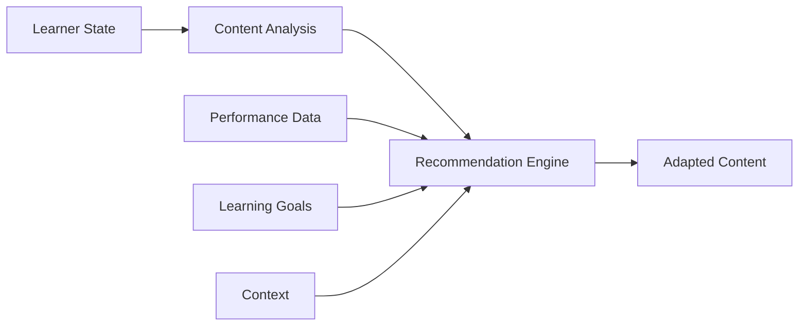

# AI Layer

The AI Layer is the intelligent core of GeniVerse, powering personalization, adaptation, and intelligent assistance throughout the learning experience. Built on modern machine learning and AI technologies, it enables the platform to understand learners, adapt content, and provide intelligent support.

## Architecture Overview

The AI Layer consists of multiple specialized AI components working together:

- **Learner Modeling**: Understanding individual learners
- **Content Recommendation**: Suggesting relevant content
- **Adaptive Assessment**: Personalizing assessments
- **Natural Language Processing**: Understanding and generating text
- **Computer Vision**: Analyzing visual content and XR interactions
- **Predictive Analytics**: Forecasting outcomes and identifying needs

## Learner Modeling

### Knowledge Tracing

The system continuously tracks what each learner knows:

- **Knowledge State**: Current understanding of concepts
- **Skill Mastery**: Proficiency levels across skills
- **Learning Velocity**: Rate of knowledge acquisition
- **Forgetting Curves**: Modeling knowledge retention over time

### Learning Style Detection

AI identifies and adapts to learning preferences:

- **Visual vs. Auditory vs. Kinesthetic**: Preferred learning modalities
- **Pacing Preferences**: Fast vs. methodical learners
- **Collaboration Style**: Independent vs. social learners
- **Challenge Tolerance**: Comfort with difficulty levels

### Behavioral Analysis

Understanding learner behavior patterns:

- **Engagement Patterns**: When and how learners engage
- **Attention Tracking**: Focus and distraction indicators
- **Interaction Patterns**: How learners interact with content
- **Social Dynamics**: Collaboration and communication patterns

## Personalization Engine

### Content Adaptation

The personalization engine adapts content in real-time:

- **Difficulty Adjustment**: Scaling content difficulty to optimal challenge level
- **Content Selection**: Choosing most relevant content from library
- **Sequence Optimization**: Ordering content for maximum learning efficiency
- **Modality Selection**: Choosing best delivery format (text, video, XR, etc.)

### Adaptive Pacing

- **Accelerated Paths**: Fast learners progress quickly with enrichment
- **Remediation Paths**: Struggling learners receive additional support
- **Mastery-Based**: Progression only after demonstrating understanding
- **Flexible Deadlines**: Adapting to individual schedules and needs

### Remediation & Enrichment

- **Automatic Remediation**: Detecting gaps and providing support
- **Enrichment Content**: Advanced materials for fast learners
- **Prerequisite Handling**: Ensuring foundational knowledge before advanced topics
- **Just-in-Time Support**: Providing help exactly when needed

## Natural Language Processing

### Content Understanding

- **Semantic Analysis**: Understanding content meaning and concepts
- **Topic Modeling**: Identifying topics and themes
- **Difficulty Estimation**: Assessing content complexity
- **Prerequisite Detection**: Identifying required prior knowledge

### Learner Communication

- **Question Answering**: Responding to learner questions
- **Conversational AI**: Natural dialogue with learners
- **Feedback Generation**: Creating personalized feedback
- **Explanation Generation**: Explaining concepts in learner-appropriate language

### Assessment Processing

- **Open-Ended Response Analysis**: Evaluating written responses
- **Essay Grading**: Automated essay evaluation with rubric alignment
- **Question Generation**: Creating assessment questions
- **Answer Explanation**: Explaining correct answers and misconceptions

## Computer Vision & XR AI

### XR Interaction Analysis

- **Gesture Recognition**: Understanding hand and body gestures
- **Spatial Understanding**: Analyzing 3D interactions
- **Object Manipulation**: Tracking how learners interact with virtual objects
- **Presence Metrics**: Measuring immersion and engagement

### Visual Content Analysis

- **Image Understanding**: Analyzing images and diagrams
- **Video Analysis**: Understanding video content and learner attention
- **3D Model Analysis**: Understanding 3D content structure
- **Visual Feedback**: Providing visual guidance and corrections

## Predictive Analytics

### Outcome Prediction

- **Performance Forecasting**: Predicting future performance
- **Completion Probability**: Estimating likelihood of course completion
- **Skill Development**: Forecasting skill acquisition timelines
- **Risk Identification**: Identifying learners at risk of failure

### Early Intervention

- **At-Risk Detection**: Identifying struggling learners early
- **Engagement Alerts**: Notifying when engagement drops
- **Intervention Recommendations**: Suggesting support strategies
- **Resource Allocation**: Optimizing educator time and resources

## Recommendation Systems

### Content Recommendations

- **Collaborative Filtering**: "Learners like you also viewed..."
- **Content-Based Filtering**: Recommendations based on content similarity
- **Hybrid Approaches**: Combining multiple recommendation strategies
- **Contextual Recommendations**: Adapting to current learning context

### Learning Path Recommendations

- **Optimal Path Finding**: Suggesting best learning sequences
- **Alternative Paths**: Offering multiple routes to learning goals
- **Prerequisite-Aware**: Ensuring proper learning progression
- **Goal-Oriented**: Aligning paths with learning objectives

## Ethical AI & Bias Mitigation

### Fairness

- **Bias Detection**: Identifying and measuring algorithmic bias
- **Fairness Metrics**: Monitoring fairness across demographic groups
- **Bias Mitigation**: Techniques to reduce bias in recommendations
- **Equity Monitoring**: Ensuring equitable outcomes

### Transparency

- **Explainable AI**: Providing explanations for AI decisions
- **Recommendation Rationale**: Explaining why content is recommended
- **Model Interpretability**: Making AI models understandable
- **Decision Logging**: Recording AI decisions for review

### Privacy

- **Differential Privacy**: Protecting individual privacy in aggregate data
- **Federated Learning**: Training models without centralizing data
- **Data Minimization**: Using only necessary data for AI
- **Consent Management**: Respecting learner privacy preferences

## Model Training & Updates

### Continuous Learning

- **Online Learning**: Updating models with new data
- **A/B Testing**: Testing model improvements
- **Performance Monitoring**: Tracking model accuracy and effectiveness
- **Model Versioning**: Managing model versions and rollbacks

### Data Management

- **Training Data Curation**: Ensuring high-quality training data
- **Data Labeling**: Creating accurate labels for supervised learning
- **Data Augmentation**: Expanding training datasets
- **Bias Auditing**: Regular audits for bias in training data

## AI Capabilities by Use Case

### For Learners

- Personalized learning paths
- Adaptive content difficulty
- Intelligent tutoring assistance
- Progress insights and recommendations
- Natural language Q&A

### For Educators

- Learner performance predictions
- At-risk learner identification
- Content effectiveness analysis
- Automated grading assistance
- Teaching recommendations

### For Administrators

- Institution-wide analytics
- Predictive insights
- Resource optimization
- Trend analysis
- Strategic planning support

## Technical Implementation

### Machine Learning Stack

- **Deep Learning**: Neural networks for complex pattern recognition
- **Reinforcement Learning**: Optimizing learning paths through trial and improvement
- **Transfer Learning**: Leveraging pre-trained models
- **Ensemble Methods**: Combining multiple models for robustness

### Infrastructure

- **Model Serving**: Efficient model deployment and inference
- **Scalability**: Handling millions of learners simultaneously
- **Latency Optimization**: Real-time personalization with low latency
- **Resource Management**: Efficient use of computational resources

### APIs & Integration

- **AI API**: Programmatic access to AI capabilities
- **Webhooks**: Event-driven AI processing
- **SDK Integration**: Easy integration for developers
- **Custom Models**: Support for institution-specific models

## Future AI Enhancements

- **Multimodal AI**: Combining text, audio, visual, and XR data
- **Advanced NLP**: More sophisticated language understanding
- **Generative AI**: Creating personalized content dynamically
- **Meta-Learning**: Learning how to learn more effectively
- **Explainable AI**: Enhanced transparency and interpretability

