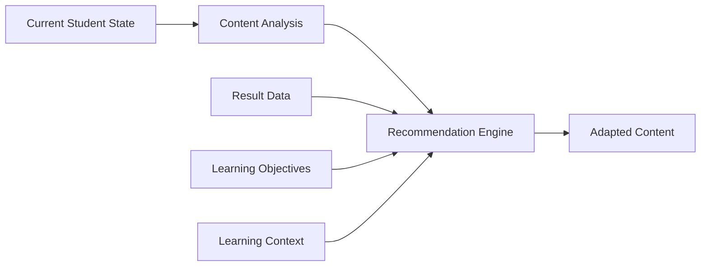

# AI Layer

The AI layer is the intelligent level of GeniVerse that supports learning personalization, content adaptation, and intelligent assistance to students and educators throughout the learning process. It is built on modern machine learning and data processing approaches and operates as a set of specialized services integrated into the platform.

*AI does not replace the teacher and does not make autonomous pedagogical decisions. All critical decisions remain under human control (the "human-in-the-loop" principle).*

---

## Architecture Overview

The AI layer consists of interconnected components:

- **learner model** — forming an understanding of knowledge level, progress, and needs
- **content recommendations** — selection of relevant materials and resources
- **adaptive assessment** — support for personalized knowledge checks
- **natural language processing** — text analysis and generation, support for dialog scenarios
- **computer vision** — analysis of visual content and interactions in XR (when needed)
- **predictive analytics** — prediction of risks and learning outcomes

---

## Learner Model

### Knowledge and Skill Tracking

The system maintains an up-to-date model of what the student has mastered and where support is needed:

- **knowledge state** — current level of understanding of key concepts
- **skill formation level** — progress in practical competencies
- **learning pace** — speed of material acquisition
- **forgetting effect** — assessment of need for review considering time

### Learning Preferences and Context

The platform considers preferences and learning conditions without rigid "student classification" by types:

- **delivery format preferences** — text, visualizations, audio, interactive practices
- **pace preferences** — faster or more sequential topic processing
- **interaction format** — individual work or group learning
- **acceptable complexity level** — comfortable level of challenge and support

### Behavioral Signals

AI analyzes patterns of interaction with content:

- **engagement indicators** — activity, regularity, task completion
- **attention indicators** — indirect signals of focus and distraction
- **interaction patterns** — how the student works with materials and tasks
- **social interactions** — participation in group work and communication

---

## Personalization Engine

### Content Adaptation

The personalization engine supports adaptation within the learning program:

- **complexity adjustment** — selection of materials according to optimal challenge level
- **content selection** — choosing relevant materials from the library
- **sequence optimization** — determining the order of topics and tasks
- **format selection** — recommending delivery format (text, video, interactive, XR, etc.)

### Pace Adaptation

- **accelerated progression** — access to advanced materials when ready
- **support in difficulties** — additional explanations, review, practices
- **mastery-based progression** — moving forward after demonstrating understanding
- **flexible deadlines** — consideration of different learning and life circumstances

### Support, Review, and Enrichment

- **gap identification** — determining topics that need review
- **review materials** — targeted explanations and practice exercises
- **enrichment** — additional resources for students ahead of the program
- **just-in-time hints** — help at the moment when it's most needed

---

## Natural Language Processing

### Educational Content Analysis

- **semantic analysis** — identifying key concepts and connections
- **topic extraction** — grouping materials by topics and subtopics
- **complexity assessment** — approximate text and requirement complexity
- **prerequisite detection** — determining necessary prior knowledge

### Student Communication Support

- **question-answer** — help with clarifications and explanations
- **dialog scenarios** — support for learning dialogue within the course
- **feedback** — generating explanatory hints based on work results
- **reformulation** — explaining complex concepts in accessible language

### Assessment Support

- **open response analysis** — preliminary assessment and summary by criteria
- **essay assessment** — support for checking based on rubrics
- **task generation** — preparing question variants and practices
- **error explanation** — identifying typical misunderstandings and corrective explanations

*Automated assessment is used as an auxiliary tool and requires criterion configuration and control by the educator.*

---

## Computer Vision and XR Components (Optional)

### XR Interaction Analysis

- **gesture recognition** — analysis of basic gestures and actions
- **spatial analysis** — tracking interactions in 3D space
- **object manipulation** — control of actions with virtual objects
- **presence indicators** — indirect engagement metrics in XR scenarios

### Visual Content Analysis

- **image analysis** — working with diagrams, illustrations, schemas
- **video analysis** — fragment indexing and search support
- **3D model analysis** — interpretation of educational 3D object structure
- **visual hints** — support for learning actions in simulations

---

## Predictive Analytics

### Outcome and Risk Prediction

- **learning outcome prediction** — assessment of probable achievement level
- **completion probability** — prediction of course non-completion risk
- **skill development dynamics** — approximate timelines for competency mastery
- **risk identification** — early signals of difficulties or engagement loss

### Early Intervention

- **risk signals** — identifying students needing additional support
- **engagement change alerts** — activity drops, absences, delays
- **support recommendations** — hints on forms of help and corrective materials
- **resource allocation support** — prioritizing educator attention

---

## Recommendation Systems

### Content Recommendations

- **collaborative approaches** — recommendations based on similar learning trajectories
- **content-oriented approaches** — recommendations by content similarity of materials
- **hybrid strategies** — combination of multiple approaches
- **contextual recommendations** — consideration of current topic, goal, and progress

### Learning Trajectory Recommendations

- **sequence selection** — suggesting optimal order of topic progression
- **alternative options** — multiple routes to learning goal
- **prerequisite consideration** — ensuring correct knowledge progression
- **goal orientation** — aligning trajectory with learning outcomes

---

## Ethics, Fairness, and Control

### Fairness

- detection of possible biases in data and results
- monitoring fairness metrics
- reducing bias influence in recommendations
- control of equal access to platform opportunities

### Transparency and Explainability

- explainable recommendations and adaptations
- brief justifications for "why this is suggested"
- model interpretability at the level of rules and signals
- logging key AI decisions for verification

### Privacy

- minimization of data necessary for algorithm operation
- data isolation mechanisms between institutions
- consent and privacy settings management
- possible application of techniques like federated learning and differential privacy (when needed)

---

## Model Training and Updates

### Model Improvement Cycle

- model updates based on new data and feedback (per selected policy)
- controlled experiments and comparative testing of changes
- monitoring model quality and stability
- model versioning and rollback capability

### Data Management

- preparation and quality control of training data
- label formation for training (with expert participation)
- data balancing to reduce biases
- regular quality and risk checks

---

## AI Capabilities by Use Case

### For Students

- personalized learning trajectories
- complexity and pace adaptation
- intelligent support during learning
- hints on progress and next steps
- question-answer within educational content

### For Educators

- early risk signals and support needs
- content and assessment effectiveness analytics
- assistance in preparing assignments and rubrics
- support for checking open responses
- recommendations for learning process correction

### For Administration

- institution-level analytics
- predictive indicators and trends
- resource planning support
- identification of systemic problems in learning programs
- support for data-driven strategic decisions

---

## Technical Implementation

### Machine Learning Approaches

- **deep learning** — for complex patterns in text, images, and interactions
- **transfer learning** — use of pre-trained models
- **ensemble approaches** — combining multiple models for increased stability
- **reinforcement and optimization** — for trajectory planning tasks (when needed)

### Infrastructure

- model deployment and maintenance service
- computation scaling according to load
- latency optimization for real-time personalization
- control of computational resource usage

### API and Integration

- API for accessing AI functions
- webhooks for "event-based" scenarios
- SDK for extensions and integrations
- possibility of institution-specific models or configurations

---

## Future Development Directions

- multimodal models for combining text, audio, visual data, and XR interactions
- development of language capabilities for explanation and dialogue
- generative tools for creating interactive educational content
- development of model explainability and interpretability
- improving personalization quality considering pedagogical constraints and regulatory requirements
