# Overview

## System Overview

**GeniVerse** is a multifunctional educational platform designed for designing, creating, and managing modern educational processes.

The system combines in a unified environment tools for:

- creating quality educational materials
- organizing and supporting the learning process
- automating bureaucratic and administrative tasks
- analyzing progress and adapting learning trajectories

GeniVerse is designed for use in various educational contexts, including:

- in K–12 education
- in higher education institutions
- in private educational initiatives
- in commercial and corporate training programs

The platform is not a classic LMS or a system for passive content consumption.  
It functions as an **educational infrastructure core**, on the basis of which institutions can build their own pedagogical models and learning formats.

---

## Key Platform Purpose

The main purpose of GeniVerse is to **improve the quality and effectiveness of learning** by combining pedagogical approaches, modern technologies, and systemic automation.

The platform helps:

- reduce the time required to master educational material
- increase student engagement in the learning process
- improve learning success through adaptive educational pathways
- reduce the workload on teachers and administration
- automate bureaucratic and organizational processes
- ensure transparency and manageability of the educational process
- create and maintain a structured database of educational materials
- help teachers create personalized learning programs
- ensure compliance of the learning process with educational goals and institutional requirements

---

## Adaptive and Contextual Learning

GeniVerse implements an adaptive learning approach where:

- the learning path adapts to the student's level of preparation, pace, and needs
- material complexity changes dynamically
- recommendations are formed based on actual progress

The learning process is complemented by gamification elements that:

- maintain motivation
- promote regular interaction with the material
- make the learning process understandable and measurable

---

## Role of Artificial Intelligence

Artificial intelligence in GeniVerse is an infrastructure component that supports the learning process, teacher work, and administrative management of educational activities.

AI is integrated into the system as a tool for processing, analyzing, and optimizing data and processes, not as an autonomous participant in learning.

Artificial intelligence is used for:

- forming adaptive learning pathways based on students' level of preparation, pace, and progress
- analyzing learning dynamics, results, and engagement
- processing the internal database of educational materials and recommendations for their updates
- assisting in creating interactive lessons and learning scenarios
- supporting teachers in developing personalized learning programs
- automating part of checks, assessments, and other routine processes
- reducing administrative workload through automation of organizational and bureaucratic tasks

Thanks to this, teachers and specialists can focus on the pedagogical, methodological, and creative components of the learning process, leaving routine data processing to the system.

*GeniVerse applies the "human-in-the-loop" principle. Artificial intelligence does not replace the teacher and does not make autonomous pedagogical or management decisions. All key decisions regarding content, assessment, and organization of the learning process are made by humans — teachers, mentors, or responsible specialists. AI acts as a support tool that helps process information, improve the learning experience, and promotes a more creative approach to forming learning programs.*

---

## Target Audience

GeniVerse is designed to work with the following user groups:

- educational institution administration
- teachers, mentors, and trainers
- students
- parents (in the context of K–12 education, with limited access)

Each role interacts with the platform within clearly defined permissions and scenarios.

---

## Documentation Purpose

This documentation describes:

- conceptual foundations of the GeniVerse platform
- its design principles
- pedagogical and technological approaches
- user roles and access mechanisms
- key functional capabilities
- security, ethics, and scaling requirements

The documentation is intended for educational institutions, product and technical teams, as well as partners planning implementation or development of the system.

---

## Documentation Structure

The material is organized from general to specific:

- **Vision and Purpose**: Fundamental principles and goals of the platform
- **Product Principles**: Core design and development principles
- **Pedagogical Model**: Learning theories and methodologies
- **Roles and Permissions**: User management and access control
- **Core Capabilities**: Platform functions and functionality
- **AI Layer**: Artificial intelligence components and algorithms
- **XR and Immersiveness**: Extended reality technologies and experiences
- **Design System**: UI/UX recommendations and components
- **Safety, Ethics, and Compliance**: Security and regulatory considerations
- **Modularity and Deployment**: Architecture and deployment options

Sequential familiarization with the sections allows forming a comprehensive understanding of the GeniVerse platform.

---

## System Architecture

```mermaid
graph TB
    User[Users]
    
    subgraph UI[" "]
        direction LR
        Web[Web Client]
        Mobile["Mobile<br/>App"]
        VR[VR Headset]
        AR[AR Device]
    end
    
    Core[Core Services]
    
    subgraph PlatformServices[" "]
        direction LR
        AI[AI Layer]
        Auth["Authorization<br/>and RBAC"]
        Data[Data Layer]
    end
    
    XR[XR Engine]
    
    subgraph External[" "]
        direction LR
        LMS[LMS Integration]
        Cloud[Cloud Services]
        Edge["Edge<br/>Computing"]
    end
    
    User --> Web
    User --> Mobile
    User --> VR
    User --> AR
    
    Web --> Core
    Mobile --> Core
    VR --> XR
    AR --> XR
    
    XR --> Core
    Core --> AI
    Core --> Auth
    Core --> Data
    
    Core --> LMS
    Core --> Cloud
    Core --> Edge
    
    classDef userClass fill:#141716,stroke:#58E6B2,stroke-width:2px
    classDef uiClass fill:#141716,stroke:#58E6B2,stroke-width:2px
    classDef coreClass fill:#141716,stroke:#7CECBF,stroke-width:2px
    classDef platformClass fill:#141716,stroke:#58E6B2,stroke-width:2px
    classDef externalClass fill:#141716,stroke:#58E6B2,stroke-width:2px
    
    class User userClass
    class Web,Mobile,VR,AR uiClass
    class Core coreClass
    class AI,Auth,Data,XR platformClass
    class LMS,Cloud,Edge externalClass
```

### Architecture Components

**Users**  
End users of the platform: students, teachers, administrators, and other participants in the educational process.

**User Interfaces**  
Various client applications for accessing the platform: web browser, mobile apps, virtual and augmented reality.

**Core Services**  
The central component of the platform that coordinates interaction between all systems and provides core business logic.

**AI Layer**  
Artificial intelligence component for data analysis, recommendation formation, and learning path adaptation.

**Authorization and RBAC**  
User access and role management system that ensures security and access control to resources.

**Data Layer**  
Data storage and management system, including educational materials, user profiles, and analytics.

**XR Engine**  
Specialized component for processing and rendering virtual and augmented reality.

**External Services**  
Integrations with external systems: LMS, cloud services, and edge computing for distributed load.
