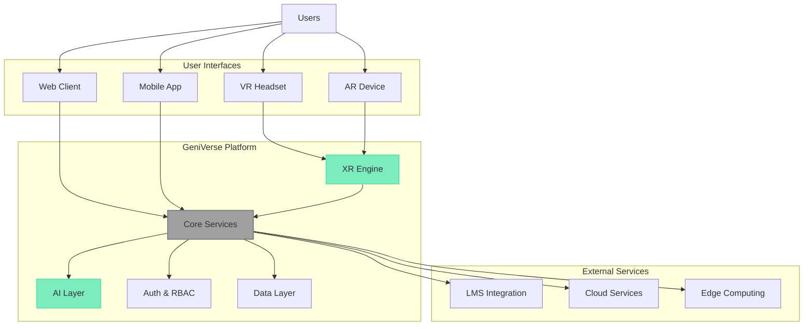

# Overview

GeniVerse is an AI-powered immersive learning platform that transforms education through personalized, adaptive experiences delivered via Extended Reality (XR) and traditional interfaces. Built on a modular architecture, GeniVerse enables institutions to deploy scalable, ethical, and pedagogically sound learning solutions.

## Core Vision

GeniVerse reimagines education by combining cutting-edge AI with immersive technologies to create personalized learning journeys that adapt in real-time to each learner's needs, preferences, and progress.

## Key Features

- **AI-Powered Personalization**: Advanced AI layer that adapts content, pacing, and delivery methods
- **Immersive XR Experiences**: Virtual and augmented reality environments for hands-on learning
- **Modular Architecture**: Flexible deployment options from cloud to edge computing
- **Comprehensive Safety**: Built-in ethical AI, privacy protection, and compliance frameworks
- **Role-Based Access Control**: Granular permissions system for all user types

## System Architecture

## Getting Started

This documentation provides comprehensive information about GeniVerse's architecture, capabilities, and implementation. Navigate through the sections to learn about:

- **Vision & Purpose**: The foundational principles and goals
- **Product Principles**: Core design and development guidelines
- **Pedagogical Framework**: Learning theories and methodologies
- **Roles & Permissions**: User management and access control
- **Core Capabilities**: Platform features and functionality
- **AI Layer**: Artificial intelligence components and algorithms
- **XR & Immersive**: Extended reality technologies and experiences
- **Design System**: UI/UX guidelines and components
- **Safety, Ethics & Compliance**: Security and regulatory considerations
- **Modularity & Deployment**: Architecture and deployment options

