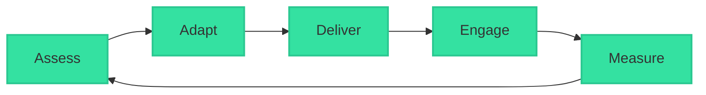

# Pedagogical Framework

GeniVerse's pedagogical framework integrates multiple learning theories and methodologies to create effective, engaging educational experiences. The framework guides content creation, AI personalization, and learning path design.

## Learning Theories

### Constructivism

Learners actively construct knowledge through experience and reflection. GeniVerse supports constructivist learning by:

- Providing immersive, hands-on experiences
- Encouraging exploration and experimentation
- Facilitating reflection and knowledge synthesis
- Supporting collaborative knowledge building

### Social Learning Theory

Learning occurs through observation, imitation, and social interaction. The platform enables social learning through:

- Multi-user XR environments
- Peer collaboration tools
- Mentorship and coaching features
- Community-driven content and discussions

### Cognitive Load Theory

Learning is optimized when cognitive resources are managed effectively. GeniVerse applies cognitive load principles by:

- Chunking information appropriately
- Providing scaffolding that fades as expertise develops
- Minimizing extraneous cognitive load
- Optimizing intrinsic load through adaptive difficulty

### Adaptive Learning

Content and pacing adapt to individual learner needs. GeniVerse's AI layer enables:

- Real-time difficulty adjustment
- Personalized content sequencing
- Remediation and enrichment pathways
- Mastery-based progression

## The GeniVerse Learning Loop

### 1. Assess

**Continuous assessment of learner state**

- Pre-assessment to establish baseline knowledge
- Formative assessments during learning
- Summative assessments for mastery verification
- Behavioral and engagement metrics
- Learning style and preference detection

### 2. Adapt

**AI-driven personalization**

- Content difficulty adjustment
- Learning path optimization
- Modality selection (visual, auditory, kinesthetic)
- Pacing adaptation
- Remediation or enrichment routing

### 3. Deliver

**Multi-modal content delivery**

- XR immersive experiences
- Interactive simulations
- Video and audio content
- Text-based materials
- Collaborative activities

### 4. Engage

**Active learning and interaction**

- Gamification elements
- Immediate feedback
- Progress visualization
- Social learning opportunities
- Achievement recognition

### 5. Measure

**Comprehensive learning analytics**

- Knowledge gain measurement
- Skill development tracking
- Engagement metrics
- Time-on-task analysis
- Outcome prediction

## Instructional Design Models

### ADDIE Framework

GeniVerse supports the ADDIE (Analysis, Design, Development, Implementation, Evaluation) model:

- **Analysis**: Learner needs and content requirements
- **Design**: Learning objectives and experience structure
- **Development**: Content creation and platform configuration
- **Implementation**: Deployment and user onboarding
- **Evaluation**: Continuous assessment and improvement

### Bloom's Taxonomy

Content and assessments align with Bloom's Taxonomy levels:

- **Remember**: Factual recall and recognition
- **Understand**: Comprehension and interpretation
- **Apply**: Using knowledge in new situations
- **Analyze**: Breaking down complex information
- **Evaluate**: Making judgments and critiques
- **Create**: Producing new or original work

### Universal Design for Learning (UDL)

GeniVerse implements UDL principles:

- **Multiple Means of Representation**: Content available in various formats
- **Multiple Means of Engagement**: Different ways to motivate learners
- **Multiple Means of Action & Expression**: Various ways to demonstrate knowledge

## Learning Modalities

### Visual Learning

- 3D visualizations and models
- Infographics and diagrams
- Video content with visual explanations
- Spatial learning in XR environments

### Auditory Learning

- Narration and audio explanations
- Podcast-style content
- Discussion forums and voice interactions
- Music and sound effects for engagement

### Kinesthetic Learning

- Hands-on XR interactions
- Physical simulations
- Gesture-based controls
- Movement-based activities

### Reading/Writing Learning

- Text-based content
- Note-taking tools
- Written assignments and reflections
- Collaborative document editing

## Assessment Strategies

### Formative Assessment

- Real-time comprehension checks
- Interactive quizzes embedded in content
- Practice exercises with immediate feedback
- Self-assessment tools

### Summative Assessment

- End-of-module assessments
- Comprehensive exams
- Project-based evaluations
- Portfolio reviews

### Authentic Assessment

- Real-world problem-solving scenarios
- XR simulations of professional tasks
- Collaborative projects
- Performance-based evaluations

## Personalization Strategies

### Learning Style Adaptation

Content delivery adapts to detected learning preferences:

- Visual learners receive more diagrams and visualizations
- Auditory learners get enhanced audio content
- Kinesthetic learners engage with interactive experiences
- Reading/writing learners access text-based materials

### Pacing Adaptation

- Fast learners progress quickly with enrichment content
- Struggling learners receive additional support and remediation
- Mastery-based progression ensures solid foundations
- Flexible deadlines accommodate different schedules

### Content Adaptation

- Difficulty level adjusts based on performance
- Prerequisite knowledge is automatically addressed
- Advanced topics unlock as readiness is demonstrated
- Remediation content appears when gaps are detected

## Research & Evidence Base

GeniVerse's pedagogical framework is informed by:

- Educational psychology research
- Learning sciences literature
- Cognitive science findings
- Educational technology studies
- User research and A/B testing results

Continuous research and validation ensure that the framework evolves with new understanding of how people learn effectively.

