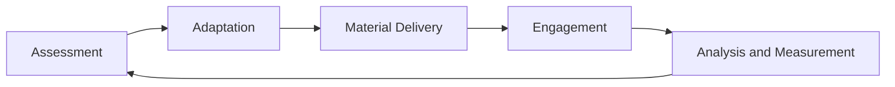

# Pedagogical Model

The GeniVerse pedagogical model is based on a combination of several learning theories, including behaviorist, cognitive, constructivist, and social approaches, as well as activity theory, experiential and self-regulated learning. This approach allows adapting the learning process to different educational contexts and student needs.

## Main Groups of Learning Theories

### 1. Behaviorism

Learning as behavior formation through stimuli and reinforcement

**Key ideas:**

- learning through repetition
- system of rewards and feedback
- clear instructions and result control

**Used in GeniVerse for:**

- basic skills
- training and automation
- gamification elements

### 2. Cognitivism

Learning as an information processing process

**Key ideas:**

- memory, attention, thinking
- structured material presentation
- reducing cognitive load

**Used in GeniVerse for:**

- designing educational materials
- adapting complexity
- building logical learning trajectories

### 3. Constructivism

Learning as active knowledge construction

**Key ideas:**

- knowledge is formed through activity
- learning through projects and research
- significance of context

**Used in GeniVerse for:**

- project-based learning
- interdisciplinary scenarios
- real-world cases

### 4. Social Constructivism

Learning through interaction with others

**Key ideas:**

- collaborative activity
- role of mentors and groups
- learning in social context

**Used in GeniVerse for:**

- team projects
- mentoring programs
- peer-to-peer learning

### 5. Activity Theory

Learning as part of practical activity

**Key ideas:**

- learning through task completion
- connection to real goals
- tools as part of the process

**Used in GeniVerse for:**

- practical tasks
- simulations
- immersive scenarios

### 6. Experiential Learning (Kolb)

Learning through an experience cycle

**Stages:**

- experience
- reflection
- conceptualization
- application

**Used in GeniVerse for:**

- iterative learning scenarios
- practical courses
- XR simulations

### 7. Self-Regulated Learning

Learning as a process managed by the student themselves

**Key ideas:**

- goal setting
- self-control
- reflection

**Used in GeniVerse for:**

- individual trajectories
- progress analytics
- learning dashboards

### 8. Universal Design for Learning (UDL)

Learning accessible to different students

**Key ideas:**

- different ways of presenting information
- different ways of interaction
- different ways of demonstrating results

**Used in GeniVerse for:**

- accessibility
- inclusive design
- customizable interfaces

### Adaptive Learning

Content and pace adapt to individual student needs. The GeniVerse AI layer enables:

- Real-time complexity adjustment
- Personalized content sequence
- Remediation and enrichment pathways
- Mastery-based progression

## Adaptive Learning Cycle

The learning process in GeniVerse is organized as a continuous adaptive cycle that combines assessment, personalization, material delivery, engagement, and analytics.

### 1. Assessment

The system provides continuous assessment of the student's learning state to form an accurate understanding of knowledge level, skills, and learning needs.

Assessment includes:

- preliminary assessment to determine baseline knowledge level
- formative assessment during the learning process
- summative assessment to verify achieved mastery level
- analysis of behavioral indicators and engagement level
- identification of learning preferences and material perception characteristics

---

### 2. Adaptation

Based on assessment results, the system supports personalization of the learning process using artificial intelligence tools.

Adaptation involves:

- adjusting the complexity level of educational materials
- optimizing the sequence and structure of the learning trajectory
- selecting material delivery formats according to learning preferences
- adapting learning pace
- directing students to material review or deeper topic exploration

---

### 3. Educational Material Delivery

GeniVerse supports multimodal delivery of educational content considering different formats and learning contexts.

The platform can use:

- interactive and, when needed, immersive XR scenarios
- educational simulations and practical models
- video and audio materials
- text explanations and reference materials
- collaborative forms of learning activities

---

### 4. Learning Engagement

The learning process is oriented toward active student participation and maintaining motivation throughout the learning cycle.

For this purpose, the following are used:

- gamification elements as a means of maintaining interest
- timely and clear feedback
- visualization of learning progress
- opportunities for social interaction and collaborative learning
- mechanisms for recognizing achievements and results

---

### 5. Analysis and Measurement of Results

The system provides comprehensive learning analytics to evaluate the effectiveness of the learning process and make informed decisions.

Analytics covers:

- assessment of knowledge growth and material understanding
- tracking development of practical skills
- analysis of engagement level
- accounting for time spent on task completion
- prediction of learning outcomes and possible risks

## Pedagogical Models and Approaches

### ADDIE Model

GeniVerse supports the ADDIE instructional design model, used for systematic design and improvement of learning programs.

The model includes these stages:

- **analysis** — determining student educational needs, learning goals, and content requirements
- **design** — forming learning objectives, course structure, and interaction scenarios
- **development** — creating educational materials and configuring the platform
- **implementation** — deploying the learning process and user onboarding
- **evaluation** — continuous effectiveness verification and improvement of learning solutions

---

### Bloom's Taxonomy

Educational content and assessment systems in GeniVerse align with Bloom's taxonomy levels, allowing sequential development of students' cognitive skills.

Taxonomy levels include:

- **remember** — reproduction and recognition of facts
- **understand** — explanation, interpretation, and generalization
- **apply** — using knowledge in new or changed situations
- **analyze** — breaking down complex information into components
- **evaluate** — forming judgments and critical reflection
- **create** — developing new or original results

---

### Universal Design for Learning (UDL)

GeniVerse implements universal design for learning principles to ensure accessibility and flexibility of the educational process.

The platform supports:

- **different ways of representing information** — educational material is available in multiple formats
- **different ways of engagement** — using different approaches to motivation and maintaining interest
- **different ways of action and expression** — ability to demonstrate learning results in various ways

---

## Learning Modalities

GeniVerse supports different learning modalities, allowing consideration of individual learning preferences and platform usage context.

### Visual Modality

- three-dimensional visualizations and models
- infographics and diagrams
- video materials with visual explanations
- spatial learning scenarios in XR environments

---

### Auditory Modality

- voiced explanations and audio commentary
- educational content in podcast format
- discussions and voice interaction
- use of sound signals to maintain attention

---

### Kinesthetic Modality

- practical interactions in XR environments
- simulations and action modeling
- gesture-based control
- learning activities based on action and movement

---

### Reading and Writing Learning

- structured textual content
- tools for creating and maintaining notes
- written assignments and reflective practices
- collaborative editing of documents and materials

## Assessment Strategies

GeniVerse supports different approaches to assessing learning outcomes to obtain a complete and objective picture of student progress.

### Formative Assessment

Formative assessment is used during the learning process for timely identification of material understanding and correction of the learning trajectory.

The platform supports:

- real-time understanding checks
- interactive quizzes integrated directly into educational content
- practical exercises with immediate and clear feedback
- tools for self-assessment and reflection

---

### Summative Assessment

Summative assessment is applied to verify achievement of learning goals after completing a topic, module, or course.

It may include:

- assessment at the end of a learning module
- comprehensive exams or tests
- project activity assessment
- review and assessment of learning portfolios

---

### Authentic Assessment

Authentic assessment is oriented toward verifying the ability to apply knowledge and skills in realistic or near-real-world conditions.

The platform supports:

- scenarios for solving practical and professionally oriented tasks
- XR simulations of work processes and professional situations
- collaborative project activities
- assessment of results based on task completion and achieved outcomes

## Personalization Strategies

Learning personalization in GeniVerse is based on a combination of analytics, adaptive mechanisms, and pedagogical principles, not on rigid student classification.

### Adaptation of Material Delivery Formats

The platform supports different formats for delivering educational content, allowing consideration of individual preferences and learning context.

Specifically:

- use of visual materials, diagrams, and visualizations
- application of audio materials and voiced explanations
- interactive and practical forms of work
- textual materials, written assignments, and reflective practices

---

### Adaptation of Learning Pace

GeniVerse supports flexible management of the learning process pace considering individual student capabilities.

The system provides:

- possibility of accelerated material progression with access to advanced topics
- providing additional support and material review in case of difficulties
- progression based on achieving necessary mastery level
- flexible task deadlines considering different learning and life circumstances

---

### Adaptation of Learning Content

Educational content adapts based on assessment results and student activity.

Adaptation may include:

- adjusting the complexity level of educational materials
- consideration of prior knowledge and experience
- gradual opening of advanced topics after demonstrating readiness
- automatic suggestion of materials to address identified gaps

## Research and Evidence Base

The GeniVerse pedagogical model relies on modern scientific research and practical data.

Specifically, it is based on:

- research in educational psychology
- scientific works in learning sciences
- conclusions from cognitive science
- research in educational technology
- results of user experience research and controlled experiments

Continuous research and solution validation ensure development of the pedagogical framework according to current understanding of how people learn most effectively.
