# Roles and Permissions

GeniVerse uses a multi-level access management model that combines role-based, attribute-based, and contextual approaches. This ensures security, flexibility, and compliance with educational and regulatory requirements.

## Role Hierarchy

```mermaid
graph TD
    A[Super Administrator] --> B[Institution Administrator]
    B --> C[Educator]
    B --> D[Educational Content Author]
    C --> E[Student]
    C --> F[Teaching Assistant]
    D --> E
    G[Parent or Guardian] --> E
    H[Guest] --> E
    
    classDef adminClass fill:#141716,stroke:#7CECBF,stroke-width:2px
    classDef educatorClass fill:#141716,stroke:#58E6B2,stroke-width:2px
    classDef studentClass fill:#141716,stroke:#58E6B2,stroke-width:2px
    classDef guestClass fill:#141716,stroke:#58E6B2,stroke-width:2px
    
    class A,B adminClass
    class C,D,F educatorClass
    class E studentClass
    class G,H guestClass
```

## Main User Roles

### Super Administrator

Administrative access at the system-wide level.

**Permissions:**

- management of all institutions and organizations
- configuration of global platform parameters
- access to full analytics and system data
- management of updates, versions, and deployments
- overriding access restrictions
- audit of access logs and security monitoring

---

### Institution Administrator

Administrative access within a specific institution.

**Permissions:**

- user management within the institution
- institution parameter configuration
- access to institution-level analytics
- payment and subscription management
- role assignment to users
- creation and management of organizational structures (departments, courses, groups)

---

### Educator (Teacher)

Teaching and management of learning courses.

**Permissions:**

- creation and management of courses
- assignment of educational content to students
- viewing student progress and analytics
- providing feedback and assessment
- course enrollment management
- access to educational resources and tools
- creation of assignments and assessment systems

---

### Educational Content Author

Development and curation of educational materials.

**Permissions:**

- creation and editing of educational content
- uploading media and resources
- organization of content libraries
- content preview in various formats
- collaboration with other authors
- submission of materials for review
- access to content usage analytics

---

### Teaching Assistant

Support of the educational process under teacher guidance.

**Permissions:**

- viewing student progress in assigned courses
- providing feedback (within permissions)
- facilitating discussions
- checking and assessing assignments with teacher confirmation
- access to limited course materials
- communication with students

---

### Student

Primary role for individuals who are learning.

**Permissions:**

- access to assigned courses and materials
- completion and submission of assignments
- viewing personal progress and analytics
- participation in discussions and collaborative activities
- access to educational resources
- configuration of learning preferences
- requesting support and help

---

### Parent or Guardian

Oversight of learning for minor students.

**Permissions:**

- viewing student progress with consideration of privacy restrictions
- receiving reports on learning results
- communication with educators
- access to limited information about the student
- participation in setting learning goals with student consent

---

### Guest

Limited access for platform familiarization.

**Permissions:**

- viewing public content and demonstrations
- access to limited functionality
- viewing open course catalogs
- creating an account for further learning

**Typical usage scenarios:**

- familiarization with platform capabilities
- course preview
- public demonstrations

---

## Permission Model

### Permission Types

Access to resources is defined at a detailed level:

- **read** — viewing data or content
- **write** — creating or modifying data
- **delete** — deleting data or content
- **execute** — launching actions or processes
- **administer** — full control over the resource

### Resource-Based Access

Permissions are applied to specific resource types:

- courses
- educational content
- users
- analytics and reports
- platform settings
- assessments and results

### Contextual Access Control

Access rights can change depending on context:

- institution membership
- role within a course
- content ownership
- time-based access restrictions
- course enrollment status

---

## Authentication and Authorization

### Authentication

- multi-factor authentication (MFA)
- SSO integration
- OAuth 2.0 and SAML support
- password management policies

### Authorization

- role-based access control (RBAC)
- attribute-based access control (ABAC)
- policy-based control for complex scenarios
- just-in-time (JIT) access provisioning

### Session Management

- secure session handling
- timeouts and session updates
- limiting number of concurrent sessions
- adaptive session extension based on activity

---

## Data Privacy and Access

### Data Minimization

Users have access only to information necessary for performing their roles:

- educators — only to data of students in their courses
- students — only to their own data
- administrators — to aggregated institution data
- parents — to limited information about the child

### Privacy Control

- detailed privacy settings
- consent management
- right to access and delete data
- information sharing configuration

### Regulatory Compliance

- FERPA — educational records
- COPPA — children's data
- GDPR — EU users
- additional requirements for sensitive data as needed

---

## Audit and Monitoring

- logging of all access attempts
- tracking changes in roles and permissions
- data access audit
- monitoring of failed login attempts
- alerts about privilege escalation
- detection of anomalous activity

---

## Best Practices

- principle of least privilege
- regular access reviews
- separation of critical duties
- temporary access for specific tasks
- standardized roles with possibility of local configuration
