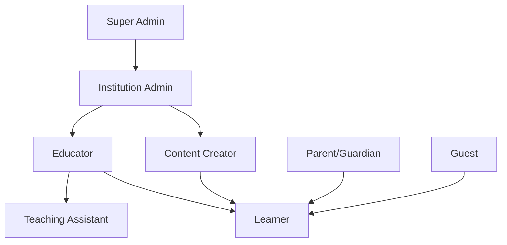

# Roles & Permissions

GeniVerse implements a comprehensive Role-Based Access Control (RBAC) system that ensures appropriate access levels for all user types while maintaining security and compliance requirements.

## Role Hierarchy

## Core Roles

### Super Admin

**System-wide administrative access**

**Permissions:**
- Manage all institutions and organizations
- Configure system-wide settings
- Access all data and analytics
- Manage platform updates and deployments
- Override any permission restrictions
- Audit logs and security monitoring

**Use Cases:**
- Platform maintenance and updates
- System configuration
- Security incident response
- Compliance audits

### Institution Admin

**Administrative access within an institution**

**Permissions:**
- Manage users within their institution
- Configure institution-level settings
- Access institution-wide analytics
- Manage billing and subscriptions
- Assign roles to users
- Create and manage organizational units (departments, courses)

**Use Cases:**
- Onboarding new educators and learners
- Configuring institution policies
- Monitoring institution-wide performance
- Managing institutional subscriptions

### Educator

**Teaching and course management**

**Permissions:**
- Create and manage courses
- Assign content to learners
- View learner progress and analytics
- Provide feedback and grades
- Manage course enrollments
- Access teaching resources and tools
- Create assessments and assignments

**Use Cases:**
- Course creation and management
- Learner progress monitoring
- Providing personalized feedback
- Facilitating discussions and collaboration

### Content Creator

**Content development and curation**

**Permissions:**
- Create and edit learning content
- Upload media and resources
- Organize content libraries
- Preview content in various formats
- Collaborate with other creators
- Submit content for review
- Access content analytics

**Use Cases:**
- Developing course materials
- Creating XR experiences
- Curating content libraries
- Collaborating on content projects

### Teaching Assistant

**Support for educators**

**Permissions:**
- View assigned learner progress
- Provide feedback (with educator approval)
- Facilitate discussions
- Grade assignments (with educator review)
- Access limited course materials
- Communicate with learners

**Use Cases:**
- Supporting large courses
- Providing additional learner support
- Facilitating group activities
- Assisting with grading

### Learner

**Primary user role for students**

**Permissions:**
- Access assigned courses and content
- Submit assignments and assessments
- View personal progress and analytics
- Participate in discussions and collaborations
- Access learning resources
- Customize learning preferences
- Request help and support

**Use Cases:**
- Completing coursework
- Engaging with learning materials
- Tracking personal progress
- Collaborating with peers

### Parent/Guardian

**Oversight for minor learners**

**Permissions:**
- View learner progress (with privacy restrictions)
- Receive progress reports
- Communicate with educators
- Access limited learner information
- Set learning goals and preferences (with learner consent)

**Use Cases:**
- Monitoring child's educational progress
- Supporting learning at home
- Communicating with educators
- Understanding learning activities

### Guest

**Limited access for visitors**

**Permissions:**
- View public content and demos
- Access limited platform features
- Create account to become learner
- Browse public course catalogs

**Use Cases:**
- Exploring platform capabilities
- Previewing content before enrollment
- Public demonstrations

## Permission Model

### Granular Permissions

Permissions are defined at a granular level:

- **Read**: View content or data
- **Write**: Create or modify content or data
- **Delete**: Remove content or data
- **Execute**: Run actions or processes
- **Admin**: Full administrative control

### Resource-Based Permissions

Permissions apply to specific resources:

- **Courses**: Access, create, modify, delete courses
- **Content**: Access, create, modify, delete content
- **Users**: View, create, modify user accounts
- **Analytics**: Access various analytics and reports
- **Settings**: Modify configuration settings
- **Assessments**: Create, grade, view assessments

### Context-Aware Permissions

Permissions may vary based on context:

- **Ownership**: Creators have elevated permissions on their content
- **Enrollment**: Learners have access to enrolled courses
- **Institution**: Permissions scoped to institution membership
- **Time-based**: Some permissions may be time-limited

## Access Control Implementation

### Authentication

- Multi-factor authentication (MFA) support
- Single Sign-On (SSO) integration
- OAuth 2.0 and SAML support
- Password policies and management

### Authorization

- Role-based access control (RBAC)
- Attribute-based access control (ABAC) for fine-grained control
- Policy-based access control for complex scenarios
- Just-in-time (JIT) access provisioning

### Session Management

- Secure session handling
- Session timeout and renewal
- Concurrent session limits
- Activity-based session extension

## Privacy & Data Access

### Data Minimization

Users only access data necessary for their role:

- Educators see learner data for their courses only
- Learners see only their own data
- Admins see institution-level aggregated data
- Parents see limited, privacy-compliant information

### Privacy Controls

- Granular privacy settings
- Data sharing preferences
- Consent management
- Right to access and deletion

### Compliance

- FERPA compliance for educational records
- COPPA compliance for children's data
- GDPR compliance for EU users
- HIPAA considerations for health-related data

## Role Assignment

### Automatic Assignment

- Roles assigned based on user type during registration
- Institution membership determines default roles
- Course enrollment grants learner access

### Manual Assignment

- Admins can assign and modify roles
- Bulk role assignment tools
- Temporary role elevation
- Role delegation capabilities

### Role Inheritance

- Some roles inherit permissions from parent roles
- Organizational hierarchy affects permissions
- Course-level roles supplement institution roles

## Audit & Compliance

### Access Logging

- All access attempts are logged
- Permission changes are tracked
- Data access is audited
- Failed access attempts are monitored

### Compliance Reporting

- Role and permission reports
- Access audit trails
- Compliance status dashboards
- Regular access reviews

### Security Monitoring

- Unusual access pattern detection
- Privilege escalation alerts
- Unauthorized access attempts
- Security incident tracking

## Best Practices

### Principle of Least Privilege

Users receive minimum permissions necessary for their role and tasks.

### Regular Access Reviews

Institution admins should regularly review user roles and permissions.

### Separation of Duties

Critical operations require multiple approvals or role separation.

### Temporary Access

Time-limited access for specific projects or tasks.

### Role Standardization

Consistent role definitions across institutions while allowing customization.

