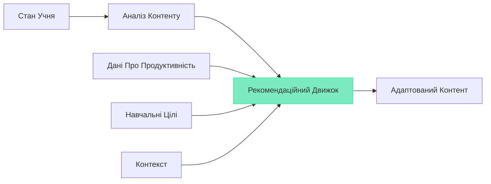

# Шар ШІ

Шар ШІ є інтелектуальним ядром GeniVerse, що забезпечує персоналізацію, адаптацію та інтелектуальну підтримку протягом усього навчального досвіду. Побудований на сучасних технологіях машинного навчання та ШІ, він дозволяє платформі розуміти учнів, адаптувати контент та надавати інтелектуальну підтримку.

## Огляд Архітектури

Шар ШІ складається з множинних спеціалізованих компонентів ШІ, які працюють разом:

- **Моделювання Учня**: Розуміння індивідуальних учнів
- **Рекомендація Контенту**: Пропозиція релевантного контенту
- **Адаптивне Оцінювання**: Персоналізація оцінок
- **Обробка Природної Мови**: Розуміння та генерація тексту
- **Комп'ютерний Зір**: Аналіз візуального контенту та XR взаємодій
- **Предиктивна Аналітика**: Прогнозування результатів та виявлення потреб

## Моделювання Учня

### Відстеження Знань

Система постійно відстежує, що знає кожен учень:

- **Стан Знань**: Поточне розуміння концепцій
- **Майстерність Навичок**: Рівні компетентності в навичках
- **Швидкість Навчання**: Темп набуття знань
- **Криві Забування**: Моделювання збереження знань з часом

### Виявлення Стилю Навчання

ШІ визначає та адаптується до навчальних переваг:

- **Візуальний vs. Слуховий vs. Кінестетичний**: Переважні модальності навчання
- **Переваги Темпу**: Швидкі vs. методичні учні
- **Стиль Співпраці**: Незалежні vs. соціальні учні
- **Толерантність до Викликів**: Комфорт з рівнями складності

### Аналіз Поведінки

Розуміння патернів поведінки учня:

- **Патерні Залучення**: Коли та як учні залучаються
- **Відстеження Уваги**: Індикатори фокусу та відволікання
- **Патерні Взаємодії**: Як учні взаємодіють з контентом
- **Соціальна Динаміка**: Патерні співпраці та комунікації

## Движок Персоналізації

### Адаптація Контенту

Движок персоналізації адаптує контент в реальному часі:

- **Корекція Складності**: Масштабування складності контенту до оптимального рівня виклику
- **Вибір Контенту**: Вибір найбільш релевантного контенту з бібліотеки
- **Оптимізація Послідовності**: Впорядкування контенту для максимальної ефективності навчання
- **Вибір Модальності**: Вибір найкращого формату доставки (текст, відео, XR тощо)

### Адаптивний Темп

- **Прискорені Шляхи**: Швидкі учні прогресує швидко з контентом збагачення
- **Шляхи Виправлення**: Учні, які мають труднощі, отримують додаткову підтримку
- **На Основі Майстерності**: Прогрес тільки після демонстрації розуміння
- **Гнучкі Дедлайни**: Адаптація до індивідуальних розкладів та потреб

### Виправлення та Збагачення

- **Автоматичне Виправлення**: Виявлення прогалин та надання підтримки
- **Контент Збагачення**: Розширені матеріали для швидких учнів
- **Обробка Передумов**: Забезпечення базових знань перед розширеними темами
- **Підтримка Саме в Час**: Надання допомоги саме коли потрібно

