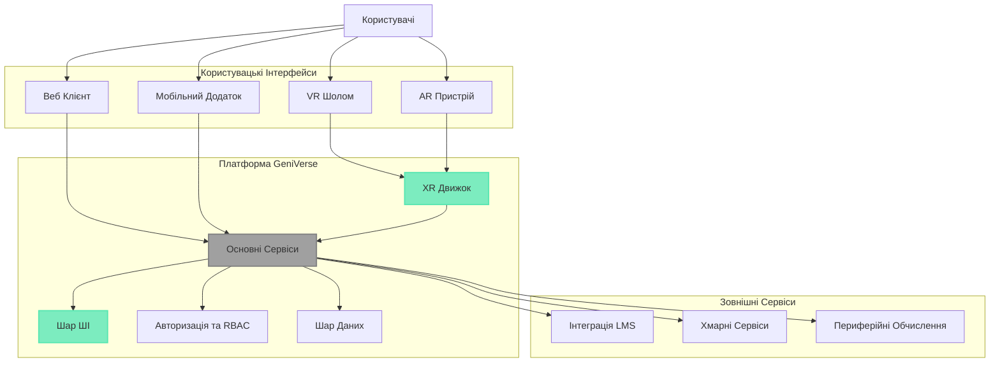

# Огляд

GeniVerse — це платформа для навчання з підтримкою штучного інтелекту та імерсивних технологій, яка трансформує освіту через персоналізовані, адаптивні досвіди, що доставляються через розширену реальність (XR) та традиційні інтерфейси. Побудована на модульній архітектурі, GeniVerse дозволяє установам розгортати масштабовані, етичні та педагогічно обґрунтовані рішення для навчання.

## Основне Бачення

GeniVerse переосмислює освіту, поєднуючи передовий штучний інтелект з імерсивними технологіями для створення персоналізованих навчальних подорожей, які адаптуються в реальному часі до потреб, переваг та прогресу кожного учня.

## Ключові Особливості

- **Персоналізація на основі ШІ**: Розвинений шар ШІ, який адаптує контент, темп та методи доставки
- **Імерсивні XR досвіди**: Віртуальні та доповнені реальні середовища для практичного навчання
- **Модульна Архітектура**: Гнучкі варіанти розгортання від хмари до периферійних обчислень
- **Комплексна Безпека**: Вбудований етичний ШІ, захист конфіденційності та рамки відповідності
- **Контроль Доступу на Основі Ролей**: Деталізована система дозволів для всіх типів користувачів

## Архітектура Системи

## Початок Роботи

Ця документація надає комплексну інформацію про архітектуру, можливості та реалізацію GeniVerse. Перегляньте розділи, щоб дізнатися про:

- **Бачення та Мета**: Фундаментальні принципи та цілі
- **Принципи Продукту**: Основні принципи дизайну та розробки
- **Педагогічна Рамка**: Теорії навчання та методології
- **Ролі та Дозволи**: Управління користувачами та контроль доступу
- **Основні Можливості**: Функції та функціональність платформи
- **Шар ШІ**: Компоненти та алгоритми штучного інтелекту
- **XR та Імерсивність**: Технології розширеної реальності та досвіди
- **Система Дизайну**: Рекомендації та компоненти UI/UX
- **Безпека, Етика та Відповідність**: Розгляди безпеки та регуляторних вимог
- **Модульність та Розгортання**: Варіанти архітектури та розгортання

