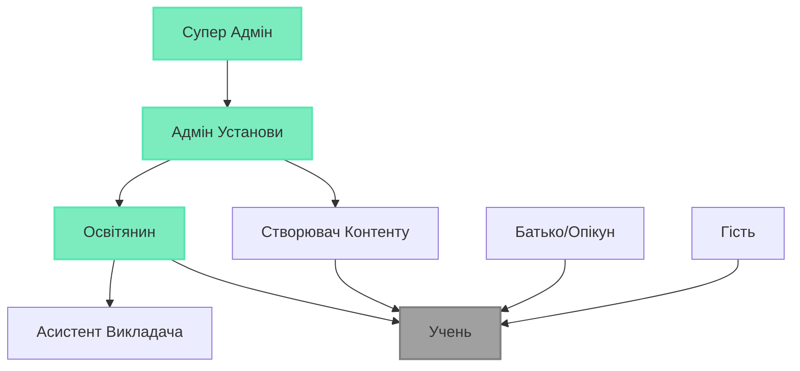

# Ролі та Дозволи

GeniVerse реалізує комплексну систему контролю доступу на основі ролей (RBAC), яка забезпечує відповідні рівні доступу для всіх типів користувачів, одночасно підтримуючи безпеку та вимоги відповідності.

## Ієрархія Ролей

## Основні Ролі

### Супер Адмін

**Адміністративний доступ на рівні системи**

**Дозволи:**
- Керування всіма установами та організаціями
- Налаштування параметрів на рівні системи
- Доступ до всіх даних та аналітики
- Керування оновленнями платформи та розгортаннями
- Перевизначення будь-яких обмежень дозволів
- Аудит журналів та моніторинг безпеки

### Адмін Установи

**Адміністративний доступ в межах установи**

**Дозволи:**
- Керування користувачами в межах їх установи
- Налаштування параметрів на рівні установи
- Доступ до аналітики на рівні установи
- Керування оплатою та підписками
- Призначення ролей користувачам
- Створення та керування організаційними підрозділами (відділи, курси)

### Освітянин

**Викладання та керування курсами**

**Дозволи:**
- Створення та керування курсами
- Призначення контенту учням
- Перегляд прогресу учнів та аналітики
- Надання зворотного зв'язку та оцінок
- Керування записами на курси
- Доступ до навчальних ресурсів та інструментів
- Створення оцінок та завдань

### Створювач Контенту

**Розробка та курація контенту**

**Дозволи:**
- Створення та редагування навчального контенту
- Завантаження медіа та ресурсів
- Організація бібліотек контенту
- Попередній перегляд контенту в різних форматах
- Співпраця з іншими творцями
- Подання контенту на перевірку
- Доступ до аналітики контенту

### Асистент Викладача

**Підтримка для освітян**

**Дозволи:**
- Перегляд призначеного прогресу учнів
- Надання зворотного зв'язку (з дозволу освітянина)
- Фасилітація обговорень
- Оцінювання завдань (з перевіркою освітянина)
- Доступ до обмеженого матеріалу курсу
- Спілкування з учнями

### Учень

**Основна роль користувача для студентів**

**Дозволи:**
- Доступ до призначених курсів та контенту
- Подання завдань та оцінок
- Перегляд особистого прогресу та аналітики
- Участь в обговореннях та співпраці
- Доступ до навчальних ресурсів
- Налаштування навчальних переваг
- Запит допомоги та підтримки

### Батько/Опікун

**Нагляд за неповнолітніми учнями**

**Дозволи:**
- Перегляд прогресу учня (з обмеженнями конфіденційності)
- Отримання звітів про прогрес
- Спілкування з освітянами
- Доступ до обмеженої інформації про учня
- Встановлення навчальних цілей та переваг (з згодою учня)

### Гість

**Обмежений доступ для відвідувачів**

**Дозволи:**
- Перегляд публічного контенту та демо
- Доступ до обмежених функцій платформи
- Створення облікового запису для стати учнем
- Перегляд публічних каталогів курсів

