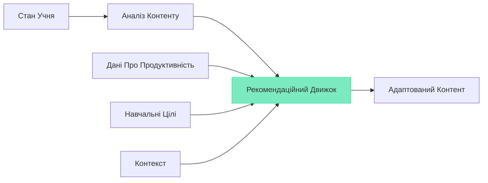

# Шар ШІ

Шар ШІ є інтелектуальним ядром GeniVerse, що забезпечує персоналізацію, адаптацію та інтелектуальну підтримку протягом усього навчального досвіду. Побудований на сучасних технологіях машинного навчання та ШІ, він дозволяє платформі розуміти учнів, адаптувати контент та надавати інтелектуальну підтримку.

## Огляд Архітектури

Шар ШІ складається з множинних спеціалізованих компонентів ШІ, які працюють разом:

- **Моделювання Учня**: Розуміння індивідуальних учнів
- **Рекомендація Контенту**: Пропозиція релевантного контенту
- **Адаптивне Оцінювання**: Персоналізація оцінок
- **Обробка Природної Мови**: Розуміння та генерація тексту
- **Комп'ютерний Зір**: Аналіз візуального контенту та XR взаємодій
- **Предиктивна Аналітика**: Прогнозування результатів та виявлення потреб

## Моделювання Учня

### Відстеження Знань

Система постійно відстежує, що знає кожен учень:

- **Стан Знань**: Поточне розуміння концепцій
- **Майстерність Навичок**: Рівні компетентності в навичках
- **Швидкість Навчання**: Темп набуття знань
- **Криві Забування**: Моделювання збереження знань з часом

### Виявлення Стилю Навчання

ШІ визначає та адаптується до навчальних переваг:

- **Візуальний vs. Слуховий vs. Кінестетичний**: Переважні модальності навчання
- **Переваги Темпу**: Швидкі vs. методичні учні
- **Стиль Співпраці**: Незалежні vs. соціальні учні
- **Толерантність до Викликів**: Комфорт з рівнями складності

### Аналіз Поведінки

Розуміння патернів поведінки учня:

- **Патерні Залучення**: Коли та як учні залучаються
- **Відстеження Уваги**: Індикатори фокусу та відволікання
- **Патерні Взаємодії**: Як учні взаємодіють з контентом
- **Соціальна Динаміка**: Патерні співпраці та комунікації

## Движок Персоналізації

### Адаптація Контенту

Движок персоналізації адаптує контент в реальному часі:

- **Корекція Складності**: Масштабування складності контенту до оптимального рівня виклику
- **Вибір Контенту**: Вибір найбільш релевантного контенту з бібліотеки
- **Оптимізація Послідовності**: Впорядкування контенту для максимальної ефективності навчання
- **Вибір Модальності**: Вибір найкращого формату доставки (текст, відео, XR тощо)

### Адаптивний Темп

- **Прискорені Шляхи**: Швидкі учні прогресує швидко з контентом збагачення
- **Шляхи Виправлення**: Учні, які мають труднощі, отримують додаткову підтримку
- **На Основі Майстерності**: Прогрес тільки після демонстрації розуміння
- **Гнучкі Дедлайни**: Адаптація до індивідуальних розкладів та потреб

### Виправлення та Збагачення

- **Автоматичне Виправлення**: Виявлення прогалин та надання підтримки
- **Контент Збагачення**: Розширені матеріали для швидких учнів
- **Обробка Передумов**: Забезпечення базових знань перед розширеними темами
- **Підтримка Саме в Час**: Надання допомоги саме коли потрібно

## Обробка Природної Мови

### Розуміння Контенту

- **Семантичний Аналіз**: Розуміння значення та концепцій контенту
- **Моделювання Тем**: Визначення тем та мотивів
- **Оцінка Складності**: Оцінка складності контенту
- **Виявлення Передумов**: Визначення необхідних попередніх знань

### Комунікація з Учнем

- **Відповіді на Питання**: Відповіді на питання учнів
- **Розмовний ШІ**: Природний діалог з учнями
- **Генерація Зворотного Зв'язку**: Створення персоналізованого зворотного зв'язку
- **Генерація Пояснень**: Пояснення концепцій мовою, зрозумілою учню

### Обробка Оцінювання

- **Аналіз Відкритих Відповідей**: Оцінювання письмових відповідей
- **Оцінювання Есе**: Автоматичне оцінювання есе з вирівнюванням рубрик
- **Генерація Питань**: Створення питань для оцінювання
- **Пояснення Відповідей**: Пояснення правильних відповідей та непорозумінь

## Комп'ютерний Зір та XR ШІ

### Аналіз XR Взаємодій

- **Розпізнавання Жестів**: Розуміння ручних та тілесних жестів
- **Просторове Розуміння**: Аналіз 3D взаємодій
- **Маніпуляція Об'єктами**: Відстеження того, як учні взаємодіють з віртуальними об'єктами
- **Метрики Присутності**: Вимірювання занурення та залучення

### Аналіз Візуального Контенту

- **Розуміння Зображень**: Аналіз зображень та діаграм
- **Аналіз Відео**: Розуміння відео контенту та уваги учня
- **Аналіз 3D Моделей**: Розуміння структури 3D контенту
- **Візуальний Зворотний Зв'язок**: Надання візуального керівництва та виправлень

## Предиктивна Аналітика

### Прогнозування Результатів

- **Прогнозування Продуктивності**: Прогнозування майбутньої продуктивності
- **Ймовірність Завершення**: Оцінка ймовірності завершення курсу
- **Розвиток Навичок**: Прогнозування термінів набуття навичок
- **Ідентифікація Ризиків**: Виявлення учнів з ризиком невдачі

### Раннє Втручання

- **Виявлення Ризиків**: Раннє виявлення учнів, які мають труднощі
- **Сповіщення про Залучення**: Сповіщення про падіння залучення
- **Рекомендації Втручання**: Пропозиція стратегій підтримки
- **Розподіл Ресурсів**: Оптимізація часу та ресурсів освітян

## Системи Рекомендацій

### Рекомендації Контенту

- **Колаборативна Фільтрація**: "Учні, подібні до вас, також переглядали..."
- **Фільтрація на Основі Контенту**: Рекомендації на основі подібності контенту
- **Гібридні Підходи**: Поєднання множинних стратегій рекомендацій
- **Контекстні Рекомендації**: Адаптація до поточного навчального контексту

### Рекомендації Навчальних Шляхів

- **Пошук Оптимального Шляху**: Пропозиція найкращих навчальних послідовностей
- **Альтернативні Шляхи**: Пропозиція множинних маршрутів до навчальних цілей
- **З Обліком Передумов**: Забезпечення правильної навчальної прогресії
- **Орієнтовані на Цілі**: Вирівнювання шляхів з навчальними цілями

## Етичний ШІ та Пом'якшення Упереджень

### Справедливість

- **Виявлення Упереджень**: Визначення та вимірювання алгоритмічних упереджень
- **Метрики Справедливості**: Моніторинг справедливості серед демографічних груп
- **Пом'якшення Упереджень**: Техніки зменшення упереджень у рекомендаціях
- **Моніторинг Рівності**: Забезпечення рівних результатів

### Прозорість

- **Пояснюваний ШІ**: Надання пояснень для рішень ШІ
- **Обґрунтування Рекомендацій**: Пояснення, чому контент рекомендовано
- **Інтерпретованість Моделей**: Робити моделі ШІ зрозумілими
- **Журналювання Рішень**: Запис рішень ШІ для перегляду

### Конфіденційність

- **Диференційна Конфіденційність**: Захист індивідуальної конфіденційності в агрегованих даних
- **Федеративне Навчання**: Тренування моделей без централізації даних
- **Мінімізація Даних**: Використання тільки необхідних даних для ШІ
- **Управління Згодою**: Повага до переваг конфіденційності учня

## Тренування Моделей та Оновлення

### Постійне Навчання

- **Онлайн Навчання**: Оновлення моделей новими даними
- **A/B Тестування**: Тестування покращень моделей
- **Моніторинг Продуктивності**: Відстеження точності та ефективності моделей
- **Версіонування Моделей**: Управління версіями моделей та відкатами

### Управління Даними

- **Курація Тренувальних Даних**: Забезпечення високоякісних тренувальних даних
- **Мітування Даних**: Створення точних міток для навчання з учителем
- **Аугментація Даних**: Розширення тренувальних наборів даних
- **Аудит Упереджень**: Регулярні аудити упереджень у тренувальних даних

## Можливості ШІ за Випадками Використання

### Для Учнів

- Персоналізовані навчальні шляхи
- Адаптивна складність контенту
- Інтелектуальна підтримка наставництва
- Інсайти прогресу та рекомендації
- Природна мова питання-відповіді

### Для Освітян

- Прогнози продуктивності учнів
- Ідентифікація учнів з ризиком
- Аналіз ефективності контенту
- Підтримка автоматичного оцінювання
- Рекомендації для викладання

### Для Адміністраторів

- Аналітика на рівні установи
- Предиктивні інсайти
- Оптимізація ресурсів
- Аналіз трендів
- Підтримка стратегічного планування

## Технічна Реалізація

### Стек Машинного Навчання

- **Глибоке Навчання**: Нейронні мережі для розпізнавання складних патернів
- **Навчання з Підкріпленням**: Оптимізація навчальних шляхів через випробування та покращення
- **Трансферне Навчання**: Використання попередньо навчених моделей
- **Ансамбльні Методи**: Поєднання множинних моделей для надійності

### Інфраструктура

- **Обслуговування Моделей**: Ефективне розгортання та виведення моделей
- **Масштабованість**: Обробка мільйонів учнів одночасно
- **Оптимізація Затримки**: Персоналізація в реальному часі з низькою затримкою
- **Управління Ресурсами**: Ефективне використання обчислювальних ресурсів

### API та Інтеграція

- **AI API**: Програмний доступ до можливостей ШІ
- **Webhooks**: Обробка ШІ на основі подій
- **Інтеграція SDK**: Легка інтеграція для розробників
- **Користувацькі Моделі**: Підтримка моделей, специфічних для установи

## Майбутні Покращення ШІ

- **Мультимодальний ШІ**: Поєднання текстових, аудіо, візуальних та XR даних
- **Розвинена NLP**: Більш складне розуміння мови
- **Генеративний ШІ**: Динамічне створення персоналізованого контенту
- **Мета-Навчання**: Навчання того, як навчатися більш ефективно
- **Пояснюваний ШІ**: Покращена прозорість та інтерпретованість

