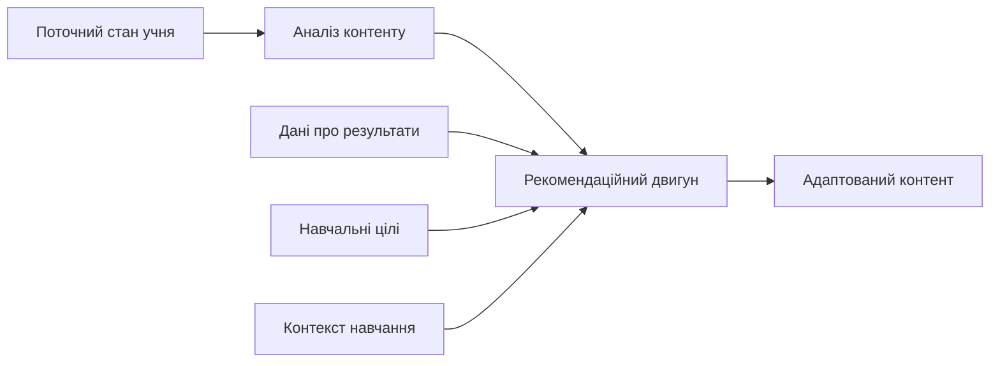

# Шар ШІ

Шар ШІ — це інтелектуальний рівень GeniVerse, що підтримує персоналізацію навчання, адаптацію контенту та інтелектуальну допомогу учням і освітянам протягом усього навчального процесу. Він побудований на сучасних підходах машинного навчання та обробки даних і працює як набір спеціалізованих сервісів, інтегрованих у платформу.

*ШІ не замінює викладача і не ухвалює автономних педагогічних рішень. Усі критичні рішення залишаються під контролем людини (принцип «людина в циклі»).*

---

## Огляд архітектури

Шар ШІ складається з взаємопов'язаних компонентів:

- **модель учня** — формування уявлення про рівень знань, прогрес і потреби
- **рекомендації контенту** — добір релевантних матеріалів і ресурсів
- **адаптивне оцінювання** — підтримка персоналізованих перевірок знань
- **обробка природної мови** — аналіз і генерація тексту, підтримка діалогових сценаріїв
- **комп'ютерний зір** — аналіз візуального контенту та взаємодій у XR (за потреби)
- **предиктивна аналітика** — прогнозування ризиків і навчальних результатів

---

## Модель учня

### Відстеження знань і навичок

Система підтримує актуальну модель того, що опанував учень і де потрібна підтримка:

- **стан знань** — поточний рівень розуміння ключових понять
- **рівень сформованості навичок** — прогрес у практичних компетентностях
- **темп навчання** — швидкість засвоєння матеріалу
- **ефект забування** — оцінка потреби в повторенні з урахуванням часу

### Навчальні переваги та контекст

Платформа враховує переваги та умови навчання без жорсткої «класифікації учнів» за типами:

- **переваги форм подачі** — текст, візуалізації, аудіо, інтерактивні практики
- **переваги темпу** — швидше або більш послідовне опрацювання тем
- **формат взаємодії** — індивідуальна робота або навчання у групі
- **рівень прийнятної складності** — комфортний рівень виклику та підтримки

### Поведінкові сигнали

ШІ аналізує патерни взаємодії з контентом:

- **ознаки залученості** — активність, регулярність, завершення завдань
- **індикатори уваги** — непрямі сигнали фокусу та відволікання
- **патерни взаємодії** — як учень працює з матеріалами та завданнями
- **соціальні взаємодії** — участь у груповій роботі та комунікації

---

## Двигун персоналізації

### Адаптація контенту

Двигун персоналізації підтримує адаптацію в межах навчальної програми:

- **коригування складності** — підбір матеріалів відповідно до оптимального рівня виклику
- **добір контенту** — вибір релевантних матеріалів із бібліотеки
- **оптимізація послідовності** — визначення порядку проходження тем і завдань
- **підбір формату** — рекомендація форми подачі (текст, відео, інтерактив, XR тощо)

### Адаптація темпу

- **прискорене проходження** — доступ до поглиблених матеріалів за умови готовності
- **підтримка у разі труднощів** — додаткові пояснення, повторення, практики
- **просування за майстерністю** — перехід далі після демонстрації розуміння
- **гнучкі терміни** — врахування різних навчальних та життєвих обставин

### Підтримка, повторення та поглиблення

- **виявлення прогалин** — визначення тем, що потребують повторного опрацювання
- **матеріали для повторення** — цільові пояснення й тренувальні вправи
- **поглиблення** — додаткові ресурси для учнів, які випереджають програму
- **підказки «саме вчасно»** — допомога у момент, коли вона найбільш потрібна

---

## Обробка природної мови

### Аналіз навчального контенту

- **семантичний аналіз** — визначення ключових понять і зв'язків
- **виділення тем** — групування матеріалів за темами та підтемами
- **оцінка складності** — орієнтовна складність тексту та вимог
- **виявлення передумов** — визначення необхідних попередніх знань

### Підтримка комунікації з учнем

- **питання–відповідь** — допомога з уточненнями та поясненнями
- **діалогові сценарії** — підтримка навчального діалогу в межах курсу
- **зворотний зв'язок** — генерація пояснювальних підказок за результатами роботи
- **переформулювання** — пояснення складних понять доступною мовою

### Підтримка оцінювання

- **аналіз відкритих відповідей** — попередня оцінка й підсумок за критеріями
- **оцінювання есе** — підтримка перевірки з опорою на рубрики
- **генерація завдань** — підготовка варіантів питань і практик
- **пояснення помилок** — виявлення типових непорозумінь і корекційні пояснення

*Автоматизоване оцінювання застосовується як допоміжний інструмент і потребує налаштувань критеріїв та контролю з боку освітянина.*

---

## Комп'ютерний зір та XR-компоненти (опційно)

### Аналіз взаємодій у XR

- **розпізнавання жестів** — аналіз базових жестів і дій
- **просторовий аналіз** — відстеження взаємодій у 3D-просторі
- **маніпуляції об'єктами** — контроль дій із віртуальними об'єктами
- **показники присутності** — непрямі метрики залученості у XR-сценаріях

### Аналіз візуального контенту

- **аналіз зображень** — робота з діаграмами, ілюстраціями, схемами
- **аналіз відео** — індексація фрагментів і підтримка пошуку
- **аналіз 3D-моделей** — інтерпретація структури навчальних 3D-об'єктів
- **візуальні підказки** — підтримка навчальних дій у симуляціях

---

## Предиктивна аналітика

### Прогнозування результатів і ризиків

- **прогнозування навчальних результатів** — оцінка ймовірного рівня досягнень
- **ймовірність завершення** — прогноз ризику незавершення курсу
- **динаміка розвитку навичок** — орієнтовні терміни опанування компетентностей
- **виявлення ризиків** — ранні сигнали труднощів або втрати залученості

### Раннє втручання

- **сигнали ризику** — виявлення учнів, які потребують додаткової підтримки
- **сповіщення про зміни залученості** — падіння активності, пропуски, затримки
- **рекомендації підтримки** — підказки щодо форм допомоги та корекційних матеріалів
- **підтримка розподілу ресурсів** — пріоритизація уваги освітян

---

## Рекомендаційні системи

### Рекомендації контенту

- **колаборативні підходи** — рекомендації на основі подібних траєкторій навчання
- **контентно-орієнтовані підходи** — рекомендації за змістовою подібністю матеріалів
- **гібридні стратегії** — поєднання кількох підходів
- **контекстні рекомендації** — врахування поточної теми, мети та прогресу

### Рекомендації навчальних траєкторій

- **підбір послідовності** — пропозиція оптимального порядку проходження тем
- **альтернативні варіанти** — кілька маршрутів до навчальної цілі
- **урахування передумов** — забезпечення коректної прогресії знань
- **орієнтація на цілі** — узгодження траєкторії з навчальними результатами

---

## Етика, справедливість і контроль

### Справедливість

- виявлення можливих упереджень у даних і результатах
- моніторинг метрик справедливості
- зменшення впливу упереджень у рекомендаціях
- контроль рівності доступу до можливостей платформи

### Прозорість і пояснюваність

- пояснювані рекомендації та адаптації
- короткі обґрунтування «чому це запропоновано»
- інтерпретованість моделей на рівні правил і сигналів
- журналювання ключових рішень ШІ для перевірки

### Конфіденційність

- мінімізація даних, необхідних для роботи алгоритмів
- механізми ізоляції даних між установами
- керування згодами та налаштуваннями конфіденційності
- можливе застосування технік на кшталт федеративного навчання та диференційної приватності (за потреби)

---

## Навчання моделей і оновлення

### Цикл вдосконалення моделей

- оновлення моделей на основі нових даних і зворотного зв'язку (за обраною політикою)
- контрольовані експерименти та порівняльне тестування змін
- моніторинг якості та стабільності моделей
- версіонування моделей і можливість відкату

### Управління даними

- підготовка та контроль якості навчальних даних
- формування міток для навчання (за участю фахівців)
- збалансування даних для зменшення упереджень
- регулярні перевірки якості та ризиків

---

## Можливості ШІ за сценаріями використання

### Для учнів

- персоналізовані навчальні траєкторії
- адаптація складності та темпу
- інтелектуальна підтримка під час навчання
- підказки щодо прогресу та наступних кроків
- питання–відповідь у межах навчального контенту

### Для освітян

- ранні сигнали ризиків і потреб у підтримці
- аналітика ефективності контенту та оцінювання
- допомога в підготовці завдань і рубрик
- підтримка перевірки відкритих відповідей
- рекомендації щодо корекції навчального процесу

### Для адміністрації

- аналітика на рівні установи
- прогнозні показники та тренди
- підтримка планування ресурсів
- виявлення системних проблем у навчальних програмах
- підтримка стратегічних рішень на основі даних

---

## Технічна реалізація

### Підходи машинного навчання

- **глибоке навчання** — для складних патернів у тексті, зображеннях і взаємодіях
- **трансферне навчання** — використання попередньо навчених моделей
- **ансамблеві підходи** — поєднання кількох моделей для підвищення стабільності
- **підкріплення та оптимізація** — для задач планування траєкторій (за потреби)

### Інфраструктура

- сервіс розгортання та обслуговування моделей
- масштабування обчислень відповідно до навантаження
- оптимізація затримок для персоналізації в реальному часі
- контроль використання обчислювальних ресурсів

### API та інтеграція

- API доступу до функцій ШІ
- webhooks для сценаріїв «на основі подій»
- SDK для розширення та інтеграцій
- можливість моделей або налаштувань, специфічних для установи

---

## Напрями подальшого розвитку

- мультимодальні моделі для поєднання тексту, аудіо, візуальних даних і XR-взаємодій
- розвиток мовних можливостей для пояснення та діалогу
- генеративні інструменти для створення інтерактивного навчального контенту
- розвиток пояснюваності та інтерпретованості моделей
- підвищення якості персоналізації з урахуванням педагогічних обмежень і нормативних вимог
