# Огляд

## Загальний опис системи

**GeniVerse** — це мультифункціональна освітня платформа, призначена для проєктування, створення та управління сучасними освітніми процесами.

Система поєднує в єдиному середовищі інструменти для:

- створення якісних навчальних матеріалів
- організації та супроводу навчального процесу
- автоматизації бюрократичних і адміністративних задач
- аналізу прогресу та адаптації навчальних траєкторій

GeniVerse створена для використання в різних освітніх контекстах, зокрема:

- у шкільній освіті (K–12)
- у вищих навчальних закладах
- у приватних освітніх ініціативах
- у комерційних та корпоративних навчальних програмах

Платформа не є класичною LMS або системою для пасивного споживання контенту.  
Вона функціонує як **освітнє інфраструктурне ядро**, на основі якого установи можуть будувати власні педагогічні моделі та формати навчання.

---

## Ключове призначення платформи

Основне призначення GeniVerse — **підвищити якість та ефективність навчання** шляхом поєднання педагогічних підходів, сучасних технологій та системної автоматизації.

Платформа допомагає:

- скоротити час засвоєння навчального матеріалу
- підвищити залученість учнів і студентів у навчальний процес
- покращити навчальну успішність за рахунок адаптивних освітніх шляхів
- зменшити навантаження на викладачів та адміністрацію
- автоматизувати бюрократичні та організаційні процеси
- забезпечити прозорість і керованість освітнього процесу
- створювати та підтримувати власну структуровану базу навчальних матеріалів
- допомагати викладачам у створенні персоналізованих навчальних програм
- забезпечувати відповідність навчального процесу освітнім цілям і вимогам установи

---

## Адаптивне та контекстне навчання

GeniVerse реалізує підхід адаптивного навчання, за якого:

- навчальний шлях підлаштовується під рівень підготовки, темп і потреби учня
- складність матеріалів змінюється динамічно
- рекомендації формуються на основі реального прогресу

Навчальний процес доповнюється елементами геймифікації, що:

- підтримують мотивацію
- сприяють регулярній взаємодії з матеріалом
- роблять процес навчання зрозумілим і вимірюваним

---

## Роль штучного інтелекту

Штучний інтелект у GeniVerse є інфраструктурним компонентом, що підтримує навчальний процес, роботу викладачів та адміністративне управління освітньою діяльністю.

AI інтегрований у систему як інструмент обробки, аналізу та оптимізації даних і процесів, а не як автономний учасник навчання.

Штучний інтелект використовується для:

- формування адаптивних навчальних шляхів на основі рівня підготовки, темпу та прогресу учнів
- аналізу навчальної динаміки, результатів і залученості
- опрацювання внутрішньої бази даних навчальних матеріалів і рекомендацій щодо їх оновлення
- допомоги у створенні інтерактивних уроків та навчальних сценаріїв
- підтримки викладачів у розробці персоналізованих навчальних програм
- автоматизації частини перевірок, оцінювання та інших рутинних процесів
- зменшення адміністративного навантаження через автоматизацію організаційних і бюрократичних задач

Завдяки цьому викладачі та спеціалісти можуть зосередитися на педагогічній, методичній і творчій складових навчального процесу, залишаючи рутинну обробку даних системі.

*У GeniVerse застосовується принцип «людина в циклі» (human-in-the-loop). Штучний інтелект не замінює викладача та не приймає автономних педагогічних або управлінських рішень. Усі ключові рішення щодо змісту, оцінювання та організації навчального процесу ухвалюються людиною — викладачем, ментором або відповідальним спеціалістом. AI виступає інструментом підтримки, який допомагає опрацьовувати інформацію, покращувати навчальний досвід і сприяє більш творчому підходу до формування навчальних програм.*

---

## Для кого призначена платформа

GeniVerse розрахована на роботу з такими групами користувачів:

- учні та студенти
- викладачі, ментори та тренери
- адміністрації освітніх установ
- батьки (у контексті K–12, з обмеженим доступом)

Кожна роль взаємодіє з платформою в межах чітко визначених дозволів і сценаріїв.

---

## Призначення документації

Ця документація описує:

- концептуальні основи платформи GeniVerse
- принципи її проєктування
- педагогічні та технологічні підходи
- ролі користувачів і механізми доступу
- ключові функціональні можливості
- вимоги до безпеки, етики та масштабування

Документація призначена для освітніх установ, продуктових і технічних команд, а також партнерів, які планують впровадження або розвиток системи.

---

## Структура документації

Матеріал організований від загального до конкретного:

- **Бачення та Мета**: Фундаментальні принципи та цілі платформи
- **Принципи Продукту**: Основні принципи дизайну та розробки
- **Педагогічна Рамка**: Теорії навчання та методології
- **Ролі та Дозволи**: Управління користувачами та контроль доступу
- **Основні Можливості**: Функції та функціональність платформи
- **Шар ШІ**: Компоненти та алгоритми штучного інтелекту
- **XR та Імерсивність**: Технології розширеної реальності та досвіди
- **Система Дизайну**: Рекомендації та компоненти UI/UX
- **Безпека, Етика та Відповідність**: Розгляди безпеки та регуляторних вимог
- **Модульність та Розгортання**: Варіанти архітектури та розгортання

Послідовне ознайомлення з розділами дозволяє сформувати цілісне розуміння платформи GeniVerse.

---

## Архітектура Системи

```mermaid
graph TB
    User[Користувачі]
    
    subgraph UI[" "]
        direction LR
        Web[Веб Клієнт]
        Mobile["Мобільний<br/>Додаток"]
        VR[VR Шолом]
        AR[AR Пристрій]
    end
    
    Core[Основні Сервіси]
    
    subgraph PlatformServices[" "]
        direction LR
        AI[Шар ШІ]
        Auth["Авторизація<br/>та RBAC"]
        Data[Шар Даних]
    end
    
    XR[XR Рушій]
    
    subgraph External[" "]
        direction LR
        LMS[Інтеграція LMS]
        Cloud[Хмарні Сервіси]
        Edge["Периферійні<br/>Обчислення"]
    end
    
    User --> Web
    User --> Mobile
    User --> VR
    User --> AR
    
    Web --> Core
    Mobile --> Core
    VR --> XR
    AR --> XR
    
    XR --> Core
    Core --> AI
    Core --> Auth
    Core --> Data
    
    Core --> LMS
    Core --> Cloud
    Core --> Edge
    
    classDef userClass fill:#141716,stroke:#58E6B2,stroke-width:2px
    classDef uiClass fill:#141716,stroke:#58E6B2,stroke-width:2px
    classDef coreClass fill:#141716,stroke:#7CECBF,stroke-width:2px
    classDef platformClass fill:#141716,stroke:#58E6B2,stroke-width:2px
    classDef externalClass fill:#141716,stroke:#58E6B2,stroke-width:2px
    
    class User userClass
    class Web,Mobile,VR,AR uiClass
    class Core coreClass
    class AI,Auth,Data,XR platformClass
    class LMS,Cloud,Edge externalClass
```

### Компоненти архітектури

**Користувачі**  
Кінцеві користувачі платформи: учні, студенти, викладачі, адміністратори та інші учасники освітнього процесу.

**Користувацькі Інтерфейси**  
Різноманітні клієнтські додатки для доступу до платформи: веб-браузер, мобільні застосунки, віртуальна та доповнена реальність.

**Основні Сервіси**  
Центральний компонент платформи, що координує взаємодію між усіма системами та забезпечує основну бізнес-логіку.

**Шар ШІ**  
Компонент штучного інтелекту для аналізу даних, формування рекомендацій та адаптації навчальних шляхів.

**Авторизація та RBAC**  
Система управління доступом та ролями користувачів, що забезпечує безпеку та контроль доступу до ресурсів.

**Шар Даних**  
Сховище та система управління даними, включаючи навчальні матеріали, профілі користувачів та аналітику.

**XR Рушій**  
Спеціалізований компонент для обробки та рендерингу віртуальної та доповненої реальності.

**Зовнішні Сервіси**  
Інтеграції з зовнішніми системами: LMS, хмарні сервіси та периферійні обчислення для розподіленого навантаження.
