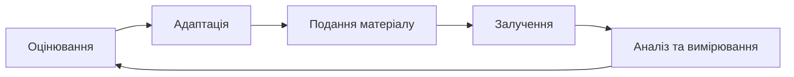

# Педагогічна модель

Педагогічна модель GeniVerse спирається на поєднання кількох теорій навчання, зокрема біхевіористських, когнітивних, конструктивістських і соціальних підходів, а також теорій діяльності, досвідного та саморегульованого навчання. Такий підхід дозволяє адаптувати навчальний процес до різних освітніх контекстів і потреб учнів.

## Основні групи теорій навчання

### 1. Біхевіоризм

Навчання як формування поведінки через стимули та підкріплення

**Ключові ідеї:**

- навчання через повторення
- система винагород і зворотного зв'язку
- чіткі інструкції та контроль результатів

**Використовується в GeniVerse для:**

- базових навичок
- тренування та автоматизації
- елементів геймифікації

### 2. Когнітивізм

Навчання як процес обробки інформації

**Ключові ідеї:**

- пам'ять, увага, мислення
- структурована подача матеріалу
- зменшення когнітивного навантаження

**Використовується в GeniVerse для:**

- проєктування навчальних матеріалів
- адаптації складності
- побудови логічних навчальних траєкторій

### 3. Конструктивізм

Навчання як активне конструювання знань

**Ключові ідеї:**

- знання формується через діяльність
- навчання через проєкти та дослідження
- значущість контексту

**Використовується в GeniVerse для:**

- проєктного навчання
- міждисциплінарних сценаріїв
- реальних кейсів

### 4. Соціальний конструктивізм

Навчання через взаємодію з іншими

**Ключові ідеї:**

- спільна діяльність
- роль менторів і груп
- навчання в соціальному контексті

**Використовується в GeniVerse для:**

- командних проєктів
- менторських програм
- peer-to-peer навчання

### 5. Теорія діяльності

Навчання як частина практичної діяльності

**Ключові ідеї:**

- навчання через виконання завдань
- зв'язок із реальними цілями
- інструменти як частина процесу

**Використовується в GeniVerse для:**

- практичних завдань
- симуляцій
- імерсивних сценаріїв

### 6. Досвідне навчання (Kolb)

Навчання через цикл досвіду

**Етапи:**

- досвід
- рефлексія
- концептуалізація
- застосування

**Використовується в GeniVerse для:**

- ітеративних навчальних сценаріїв
- практичних курсів
- XR-симуляцій

### 7. Саморегульоване навчання

Навчання як керований самим учнем процес

**Ключові ідеї:**

- постановка цілей
- самоконтроль
- рефлексія

**Використовується в GeniVerse для:**

- індивідуальних траєкторій
- аналітики прогресу
- навчальних дашбордів

### 8. Універсальний дизайн для навчання (UDL)

Навчання, доступне для різних учнів

**Ключові ідеї:**

- різні способи подачі інформації
- різні способи взаємодії
- різні способи демонстрації результатів

**Використовується в GeniVerse для:**

- доступності
- інклюзивного дизайну
- налаштовуваних інтерфейсів

### Адаптивне Навчання

Контент та темп адаптуються до індивідуальних потреб учнів. Шар ШІ GeniVerse уможливлює:

- Корекцію складності в реальному часі
- Персоналізовану послідовність контенту
- Шляхи виправлення та збагачення
- Прогрес на основі майстерності

## Адаптивний навчальний цикл

Навчальний процес у GeniVerse організований як безперервний адаптивний цикл, що поєднує оцінювання, персоналізацію, подачу матеріалу, залучення та аналітику.

### 1. Оцінювання

Система забезпечує постійне оцінювання навчального стану учня з метою формування актуального уявлення про рівень знань, навичок і навчальні потреби.

Оцінювання включає:

- попереднє оцінювання для визначення базового рівня знань
- формувальне оцінювання під час навчального процесу
- підсумкове оцінювання для перевірки досягнутого рівня опанування матеріалу
- аналіз поведінкових показників і рівня залученості
- виявлення навчальних переваг і особливостей сприйняття матеріалу

---

### 2. Адаптація

На основі результатів оцінювання система підтримує персоналізацію навчального процесу з використанням інструментів штучного інтелекту.

Адаптація передбачає:

- коригування рівня складності навчального матеріалу
- оптимізацію послідовності та структури навчальної траєкторії
- підбір форм подачі матеріалу відповідно до навчальних переваг
- адаптацію темпу навчання
- спрямування учня до повторення матеріалу або поглибленого опрацювання тем

---

### 3. Подання навчального матеріалу

GeniVerse підтримує багатомодальну подачу навчального контенту з урахуванням різних форматів і контекстів навчання.

Платформа може використовувати:

- інтерактивні та, за потреби, імерсивні XR-сценарії
- навчальні симуляції та практичні моделі
- відео- та аудіоматеріали
- текстові пояснення та довідкові матеріали
- спільні форми навчальної діяльності

---

### 4. Залучення до навчання

Навчальний процес орієнтований на активну участь учнів і підтримку мотивації протягом усього навчального циклу.

Для цього використовуються:

- елементи гейміфікації як засіб підтримки інтересу
- своєчасний і зрозумілий зворотний зв'язок
- візуалізація навчального прогресу
- можливості соціальної взаємодії та спільного навчання
- механізми визнання досягнень і результатів

---

### 5. Аналіз та вимірювання результатів

Система забезпечує комплексну навчальну аналітику для оцінки ефективності навчального процесу та прийняття обґрунтованих рішень.

Аналітика охоплює:

- оцінку приросту знань і розуміння матеріалу
- відстеження розвитку практичних навичок
- аналіз рівня залученості
- облік часу, витраченого на виконання завдань
- прогнозування навчальних результатів і можливих ризиків

## Педагогічні моделі та підходи

### Модель ADDIE

GeniVerse підтримує модель інструкційного дизайну ADDIE, яка використовується для системного проєктування та вдосконалення навчальних програм.

Модель включає такі етапи:

- **аналіз** — визначення освітніх потреб учнів, навчальних цілей та вимог до контенту
- **дизайн** — формування навчальних цілей, структури курсу та сценаріїв взаємодії
- **розробка** — створення навчальних матеріалів і налаштування платформи
- **впровадження** — розгортання навчального процесу та онбординг користувачів
- **оцінювання** — постійна перевірка ефективності та вдосконалення навчальних рішень

---

### Таксономія Блума

Навчальний контент і системи оцінювання в GeniVerse узгоджуються з рівнями таксономії Блума, що дозволяє послідовно розвивати когнітивні навички учнів.

Рівні таксономії включають:

- **запам'ятати** — відтворення та розпізнавання фактів
- **зрозуміти** — пояснення, інтерпретація та узагальнення
- **застосувати** — використання знань у нових або змінених ситуаціях
- **проаналізувати** — розкладання складної інформації на складові
- **оцінити** — формування суджень і критичне осмислення
- **створити** — розробка нового або оригінального результату

---

### Універсальний дизайн для навчання (UDL)

GeniVerse впроваджує принципи універсального дизайну для навчання з метою забезпечення доступності та гнучкості освітнього процесу.

Платформа підтримує:

- **різні способи представлення інформації** — навчальний матеріал доступний у кількох форматах
- **різні способи залучення** — використання різних підходів до мотивації та підтримки інтересу
- **різні способи дії та самовираження** — можливість демонстрації результатів навчання різними способами

---

## Модальності навчання

GeniVerse підтримує різні модальності навчання, що дозволяє враховувати індивідуальні навчальні переваги та контекст використання платформи.

### Візуальна модальність

- тривимірні візуалізації та моделі
- інфографіка та діаграми
- відеоматеріали з візуальними поясненнями
- просторові сценарії навчання в XR-середовищах

---

### Слухова модальність

- озвучені пояснення та аудіокоментарі
- навчальний контент у форматі подкастів
- обговорення та голосова взаємодія
- використання звукових сигналів для підтримки уваги

---

### Кінестетична модальність

- практичні взаємодії в XR-середовищах
- симуляції та моделювання дій
- керування за допомогою жестів
- навчальні активності, засновані на дії та русі

---

### Навчання через читання та письмо

- структурований текстовий контент
- інструменти для створення та ведення нотаток
- письмові завдання та рефлексивні практики
- спільне редагування документів і матеріалів

## Стратегії оцінювання

GeniVerse підтримує різні підходи до оцінювання навчальних результатів з метою отримання повної та об'єктивної картини прогресу учнів.

### Формувальне оцінювання

Формувальне оцінювання використовується під час навчального процесу для своєчасного виявлення розуміння матеріалу та корекції навчальної траєкторії.

Платформа підтримує:

- перевірки розуміння в реальному часі
- інтерактивні вікторини, інтегровані безпосередньо в навчальний контент
- практичні вправи з негайним і зрозумілим зворотним зв'язком
- інструменти для самооцінки та рефлексії

---

### Підсумкове оцінювання

Підсумкове оцінювання застосовується для перевірки досягнення навчальних цілей після завершення теми, модуля або курсу.

Воно може включати:

- оцінювання наприкінці навчального модуля
- комплексні іспити або контрольні роботи
- оцінювання проєктної діяльності
- огляд і оцінювання навчального портфоліо

---

### Автентичне оцінювання

Автентичне оцінювання орієнтоване на перевірку здатності застосовувати знання та навички в реалістичних або наближених до реальності умовах.

Платформа підтримує:

- сценарії розв'язання практичних і професійно орієнтованих задач
- XR-симуляції робочих процесів і професійних ситуацій
- спільну проєктну діяльність
- оцінювання результатів на основі виконання завдань і досягнутих результатів

## Стратегії персоналізації

Персоналізація навчання в GeniVerse ґрунтується на поєднанні аналітики, адаптивних механізмів і педагогічних принципів, а не на жорсткій класифікації учнів.

### Адаптація форм подачі матеріалу

Платформа підтримує різні формати подачі навчального контенту, що дозволяє враховувати індивідуальні переваги та контекст навчання.

Зокрема:

- використання візуальних матеріалів, схем і візуалізацій
- застосування аудіоматеріалів та озвучених пояснень
- інтерактивні та практичні форми роботи
- текстові матеріали, письмові завдання та рефлексивні практики

---

### Адаптація темпу навчання

GeniVerse підтримує гнучке керування темпом навчального процесу з урахуванням індивідуальних можливостей учнів.

Система передбачає:

- можливість прискореного проходження матеріалу з доступом до розширених тем
- надання додаткової підтримки та повторного опрацювання матеріалу у разі труднощів
- просування на основі досягнення необхідного рівня опанування матеріалу
- гнучкі терміни виконання завдань з урахуванням різних навчальних і життєвих обставин

---

### Адаптація змісту навчання

Навчальний контент адаптується на основі результатів оцінювання та активності учнів.

Адаптація може включати:

- коригування рівня складності навчальних матеріалів
- врахування попередніх знань і досвіду
- поступове відкриття розширених тем після демонстрації готовності
- автоматичну пропозицію матеріалів для усунення виявлених прогалин

## Дослідження та База Доказів

Педагогічна модель GeniVerse ґрунтується на:

- Дослідженнях освітньої психології
- Літературі наук про навчання
- Висновках когнітивної науки
- Дослідженнях освітніх технологій
- Результатах досліджень користувачів та A/B тестування

Постійні дослідження та валідація забезпечують, що рамка розвивається з новим розумінням того, як люди навчаються ефективно.

