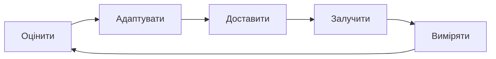

# Педагогічна модель

Педагогічна модель GeniVerse спирається на поєднання кількох теорій навчання, зокрема біхевіористських, когнітивних, конструктивістських і соціальних підходів, а також теорій діяльності, досвідного та саморегульованого навчання. Такий підхід дозволяє адаптувати навчальний процес до різних освітніх контекстів і потреб учнів.

## Основні групи теорій навчання

### 1. Біхевіоризм

Навчання як формування поведінки через стимули та підкріплення

**Ключові ідеї:**

- навчання через повторення
- система винагород і зворотного зв'язку
- чіткі інструкції та контроль результатів

**Використовується в GeniVerse для:**

- базових навичок
- тренування та автоматизації
- елементів геймифікації

### 2. Когнітивізм

Навчання як процес обробки інформації

**Ключові ідеї:**

- пам'ять, увага, мислення
- структурована подача матеріалу
- зменшення когнітивного навантаження

**Використовується в GeniVerse для:**

- проєктування навчальних матеріалів
- адаптації складності
- побудови логічних навчальних траєкторій

### 3. Конструктивізм

Навчання як активне конструювання знань

**Ключові ідеї:**

- знання формується через діяльність
- навчання через проєкти та дослідження
- значущість контексту

**Використовується в GeniVerse для:**

- проєктного навчання
- міждисциплінарних сценаріїв
- реальних кейсів

### 4. Соціальний конструктивізм

Навчання через взаємодію з іншими

**Ключові ідеї:**

- спільна діяльність
- роль менторів і груп
- навчання в соціальному контексті

**Використовується в GeniVerse для:**

- командних проєктів
- менторських програм
- peer-to-peer навчання

### 5. Теорія діяльності

Навчання як частина практичної діяльності

**Ключові ідеї:**

- навчання через виконання завдань
- зв'язок із реальними цілями
- інструменти як частина процесу

**Використовується в GeniVerse для:**

- практичних завдань
- симуляцій
- імерсивних сценаріїв

### 6. Досвідне навчання (Kolb)

Навчання через цикл досвіду

**Етапи:**

- досвід
- рефлексія
- концептуалізація
- застосування

**Використовується в GeniVerse для:**

- ітеративних навчальних сценаріїв
- практичних курсів
- XR-симуляцій

### 7. Саморегульоване навчання

Навчання як керований самим учнем процес

**Ключові ідеї:**

- постановка цілей
- самоконтроль
- рефлексія

**Використовується в GeniVerse для:**

- індивідуальних траєкторій
- аналітики прогресу
- навчальних дашбордів

### 8. Універсальний дизайн для навчання (UDL)

Навчання, доступне для різних учнів

**Ключові ідеї:**

- різні способи подачі інформації
- різні способи взаємодії
- різні способи демонстрації результатів

**Використовується в GeniVerse для:**

- доступності
- інклюзивного дизайну
- налаштовуваних інтерфейсів

### Адаптивне Навчання

Контент та темп адаптуються до індивідуальних потреб учнів. Шар ШІ GeniVerse уможливлює:

- Корекцію складності в реальному часі
- Персоналізовану послідовність контенту
- Шляхи виправлення та збагачення
- Прогрес на основі майстерності

## Навчальний Цикл GeniVerse

### 1. Оцінити

**Постійна оцінка стану учня**

- Попередня оцінка для встановлення базових знань
- Формативні оцінки під час навчання
- Підсумкові оцінки для перевірки майстерності
- Метрики поведінки та залучення
- Виявлення стилю навчання та переваг

### 2. Адаптувати

**Персоналізація на основі ШІ**

- Корекція складності контенту
- Оптимізація навчального шляху
- Вибір модальності (візуальна, слухова, кінестетична)
- Адаптація темпу
- Маршрутизація виправлення або збагачення

### 3. Доставити

**Багатомодальна доставка контенту**

- Імерсивні XR досвіди
- Інтерактивні симуляції
- Відео та аудіо контент
- Текстовий матеріал
- Спільні діяльності

### 4. Залучити

**Активне навчання та взаємодія**

- Елементи гейміфікації
- Негайний зворотний зв'язок
- Візуалізація прогресу
- Можливості соціального навчання
- Визнання досягнень

### 5. Виміряти

**Комплексна навчальна аналітика**

- Вимірювання приросту знань
- Відстеження розвитку навичок
- Метрики залучення
- Аналіз часу на завдання
- Прогнозування результатів

## Моделі Інструкційного Дизайну

### Рамка ADDIE

GeniVerse підтримує модель ADDIE (Аналіз, Дизайн, Розробка, Впровадження, Оцінювання):

- **Аналіз**: Потреби учнів та вимоги до контенту
- **Дизайн**: Навчальні цілі та структура досвіду
- **Розробка**: Створення контенту та конфігурація платформи
- **Впровадження**: Розгортання та онбординг користувачів
- **Оцінювання**: Постійна оцінка та покращення

### Таксономія Блума

Контент та оцінки вирівняні з рівнями таксономії Блума:

- **Запам'ятати**: Фактичне відтворення та розпізнавання
- **Зрозуміти**: Розуміння та інтерпретація
- **Застосувати**: Використання знань у нових ситуаціях
- **Проаналізувати**: Розбиття складної інформації
- **Оцінити**: Прийняття суджень та критики
- **Створити**: Створення нового або оригінального роботи

### Універсальний Дизайн для Навчання (UDL)

GeniVerse впроваджує принципи UDL:

- **Множинні Засоби Представлення**: Контент доступний у різних форматах
- **Множинні Засоби Залучення**: Різні способи мотивації учнів
- **Множинні Засоби Дії та Висловлювання**: Різні способи демонстрації знань

## Модальності Навчання

### Візуальне Навчання

- 3D візуалізації та моделі
- Інфографіка та діаграми
- Відео контент з візуальними поясненнями
- Просторове навчання в XR середовищах

### Слухове Навчання

- Озвучення та аудіо пояснення
- Контент у стилі подкастів
- Форуми обговорень та голосові взаємодії
- Музика та звукові ефекти для залучення

### Кінестетичне Навчання

- Практичні XR взаємодії
- Фізичні симуляції
- Контролі на основі жестів
- Діяльності на основі руху

### Читання/Письмо Навчання

- Текстовий контент
- Інструменти для нотаток
- Письмові завдання та рефлексії
- Спільне редагування документів

## Стратегії Оцінювання

### Формативне Оцінювання

- Перевірки розуміння в реальному часі
- Інтерактивні вікторини, вбудовані в контент
- Вправи для практики з негайним зворотним зв'язком
- Інструменти самооцінки

### Підсумкове Оцінювання

- Оцінки в кінці модуля
- Комплексні іспити
- Оцінки на основі проєктів
- Огляди портфоліо

### Автентичне Оцінювання

- Сценарії вирішення реальних проблем
- XR симуляції професійних завдань
- Спільні проєкти
- Оцінки на основі продуктивності

## Стратегії Персоналізації

### Адаптація Стилю Навчання

Доставка контенту адаптується до виявлених навчальних переваг:

- Візуальні учні отримують більше діаграм та візуалізацій
- Слухові учні отримують покращений аудіо контент
- Кінестетичні учні взаємодіють з інтерактивними досвідами
- Читаючі/пишучі учні мають доступ до текстових матеріалів

### Адаптація Темпу

- Швидкі учні прогресує швидко з контентом збагачення
- Учні, які мають труднощі, отримують додаткову підтримку та виправлення
- Прогрес на основі майстерності забезпечує міцні основи
- Гнучкі дедлайни враховують різні розклади

### Адаптація Контенту

- Рівень складності корегується на основі продуктивності
- Попередні знання автоматично враховуються
- Розширені теми розблоковуються, коли демонструється готовність
- Контент виправлення з'являється, коли виявляються прогалини

## Дослідження та База Доказів

Педагогічна модель GeniVerse ґрунтується на:

- Дослідженнях освітньої психології
- Літературі наук про навчання
- Висновках когнітивної науки
- Дослідженнях освітніх технологій
- Результатах досліджень користувачів та A/B тестування

Постійні дослідження та валідація забезпечують, що рамка розвивається з новим розумінням того, як люди навчаються ефективно.

