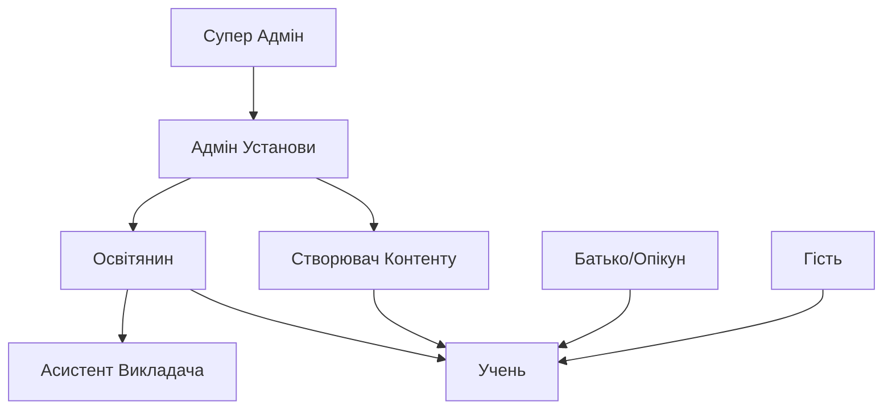

# Ролі та Дозволи

GeniVerse реалізує комплексну систему контролю доступу на основі ролей (RBAC), яка забезпечує відповідні рівні доступу для всіх типів користувачів, одночасно підтримуючи безпеку та вимоги відповідності.

## Ієрархія Ролей

## Основні Ролі

### Супер Адмін

**Адміністративний доступ на рівні системи**

**Дозволи:**
- Керування всіма установами та організаціями
- Налаштування параметрів на рівні системи
- Доступ до всіх даних та аналітики
- Керування оновленнями платформи та розгортаннями
- Перевизначення будь-яких обмежень дозволів
- Аудит журналів та моніторинг безпеки

### Адмін Установи

**Адміністративний доступ в межах установи**

**Дозволи:**
- Керування користувачами в межах їх установи
- Налаштування параметрів на рівні установи
- Доступ до аналітики на рівні установи
- Керування оплатою та підписками
- Призначення ролей користувачам
- Створення та керування організаційними підрозділами (відділи, курси)

### Освітянин

**Викладання та керування курсами**

**Дозволи:**
- Створення та керування курсами
- Призначення контенту учням
- Перегляд прогресу учнів та аналітики
- Надання зворотного зв'язку та оцінок
- Керування записами на курси
- Доступ до навчальних ресурсів та інструментів
- Створення оцінок та завдань

### Створювач Контенту

**Розробка та курація контенту**

**Дозволи:**
- Створення та редагування навчального контенту
- Завантаження медіа та ресурсів
- Організація бібліотек контенту
- Попередній перегляд контенту в різних форматах
- Співпраця з іншими творцями
- Подання контенту на перевірку
- Доступ до аналітики контенту

### Асистент Викладача

**Підтримка для освітян**

**Дозволи:**
- Перегляд призначеного прогресу учнів
- Надання зворотного зв'язку (з дозволу освітянина)
- Фасилітація обговорень
- Оцінювання завдань (з перевіркою освітянина)
- Доступ до обмеженого матеріалу курсу
- Спілкування з учнями

### Учень

**Основна роль користувача для студентів**

**Дозволи:**
- Доступ до призначених курсів та контенту
- Подання завдань та оцінок
- Перегляд особистого прогресу та аналітики
- Участь в обговореннях та співпраці
- Доступ до навчальних ресурсів
- Налаштування навчальних переваг
- Запит допомоги та підтримки

### Батько/Опікун

**Нагляд за неповнолітніми учнями**

**Дозволи:**
- Перегляд прогресу учня (з обмеженнями конфіденційності)
- Отримання звітів про прогрес
- Спілкування з освітянами
- Доступ до обмеженої інформації про учня
- Встановлення навчальних цілей та переваг (з згодою учня)

### Гість

**Обмежений доступ для відвідувачів**

**Дозволи:**
- Перегляд публічного контенту та демо
- Доступ до обмежених функцій платформи
- Створення облікового запису для стати учнем
- Перегляд публічних каталогів курсів

**Випадки Використання:**
- Дослідження можливостей платформи
- Попередній перегляд контенту перед записом
- Публічні демонстрації

## Модель Дозволів

### Деталізовані Дозволи

Дозволи визначені на деталізованому рівні:

- **Читання**: Перегляд контенту або даних
- **Запис**: Створення або зміна контенту або даних
- **Видалення**: Видалення контенту або даних
- **Виконання**: Запуск дій або процесів
- **Адмін**: Повний адміністративний контроль

### Дозволи на Основі Ресурсів

Дозволи застосовуються до конкретних ресурсів:

- **Курси**: Доступ, створення, зміна, видалення курсів
- **Контент**: Доступ, створення, зміна, видалення контенту
- **Користувачі**: Перегляд, створення, зміна облікових записів користувачів
- **Аналітика**: Доступ до різної аналітики та звітів
- **Налаштування**: Зміна налаштувань конфігурації
- **Оцінки**: Створення, оцінювання, перегляд оцінок

### Контекстно-Обізнані Дозволи

Дозволи можуть відрізнятися залежно від контексту:

- **Власність**: Творці мають підвищені дозволи на свій контент
- **Запис**: Учні мають доступ до записаних курсів
- **Установа**: Дозволи обмежені членством у установі
- **Часова Основа**: Деякі дозволи можуть бути обмежені за часом

## Впровадження Контролю Доступу

### Аутентифікація

- Підтримка багатофакторної аутентифікації (MFA)
- Інтеграція Single Sign-On (SSO)
- Підтримка OAuth 2.0 та SAML
- Політики та управління паролями

### Авторизація

- Контроль доступу на основі ролей (RBAC)
- Контроль доступу на основі атрибутів (ABAC) для деталізованого контролю
- Контроль доступу на основі політик для складних сценаріїв
- Надання доступу саме в час (JIT)

### Управління Сесіями

- Безпечна обробка сесій
- Таймаут та оновлення сесій
- Обмеження одночасних сесій
- Розширення сесій на основі активності

## Конфіденційність та Доступ до Даних

### Мінімізація Даних

Користувачі мають доступ тільки до даних, необхідних для їх ролі:

- Освітяни бачать дані учнів тільки для своїх курсів
- Учні бачать тільки свої власні дані
- Адміни бачать агреговані дані на рівні установи
- Батьки бачать обмежену, відповідну конфіденційності інформацію

### Контролі Конфіденційності

- Деталізовані налаштування конфіденційності
- Переваги обміну даними
- Управління згодою
- Право на доступ та видалення

### Відповідність

- Відповідність FERPA для освітніх записів
- Відповідність COPPA для даних дітей
- Відповідність GDPR для користувачів ЄС
- Розгляди HIPAA для даних, пов'язаних зі здоров'ям

## Призначення Ролей

### Автоматичне Призначення

- Ролі призначаються на основі типу користувача під час реєстрації
- Членство в установі визначає ролі за замовчуванням
- Запис на курс надає доступ учня

### Ручне Призначення

- Адміни можуть призначати та змінювати ролі
- Інструменти масового призначення ролей
- Тимчасове підвищення ролі
- Можливості делегування ролей

### Наслідування Ролей

- Деякі ролі наслідують дозволи від батьківських ролей
- Організаційна ієрархія впливає на дозволи
- Ролі на рівні курсу доповнюють ролі установи

## Аудит та Відповідність

### Журналювання Доступу

- Всі спроби доступу журналюються
- Зміни дозволів відстежуються
- Доступ до даних аудитується
- Невдалі спроби доступу моніторяться

### Звітування про Відповідність

- Звіти про ролі та дозволи
- Аудит слідів доступу
- Панелі стану відповідності
- Регулярні перегляди доступу

### Моніторинг Безпеки

- Виявлення незвичайних патернів доступу
- Сповіщення про підвищення привілеїв
- Спроби несанкціонованого доступу
- Відстеження інцидентів безпеки

## Найкращі Практики

### Принцип Найменших Привілеїв

Користувачі отримують мінімальні дозволи, необхідні для їх ролі та завдань.

### Регулярні Перегляди Доступу

Адміни установи повинні регулярно переглядати ролі та дозволи користувачів.

### Розділення Обов'язків

Критичні операції вимагають множинних схвалень або розділення ролей.

### Тимчасовий Доступ

Доступ, обмежений за часом, для конкретних проєктів або завдань.

### Стандартизація Ролей

Послідовні визначення ролей між установами з дозволом налаштування.

