# Ролі та Дозволи
  
GeniVerse використовує багаторівневу модель керування доступом, що поєднує рольовий, атрибутивний та контекстний підходи. Це забезпечує безпеку, гнучкість і відповідність освітнім та нормативним вимогам.

## Ієрархія ролей

```mermaid
graph TD
    A[Суперадміністратор] --> B[Адміністратор установи]
    B --> C[Освітянин]
    B --> D[Створювач контенту]
    C --> E[Учень]
    C --> F[Асистент викладача]
    D --> E
    G[Батько або опікун] --> E
    H[Гість] --> E
    
    classDef adminClass fill:#141716,stroke:#7CECBF,stroke-width:2px
    classDef educatorClass fill:#141716,stroke:#58E6B2,stroke-width:2px
    classDef studentClass fill:#141716,stroke:#58E6B2,stroke-width:2px
    classDef guestClass fill:#141716,stroke:#58E6B2,stroke-width:2px
    
    class A,B adminClass
    class C,D,F educatorClass
    class E studentClass
    class G,H guestClass
```

## Основні ролі користувачів

### Суперадміністратор

Адміністративний доступ на рівні всієї системи.

**Дозволи:**

- керування всіма установами та організаціями
- налаштування глобальних параметрів платформи
- доступ до повної аналітики та системних даних
- керування оновленнями, версіями та розгортаннями
- перевизначення обмежень доступу
- аудит журналів доступу та моніторинг безпеки

---

### Адміністратор установи

Адміністративний доступ у межах конкретної установи.

**Дозволи:**

- керування користувачами в межах установи
- налаштування параметрів установи
- доступ до аналітики на рівні установи
- керування оплатою та підписками
- призначення ролей користувачам
- створення та керування організаційними структурами (відділи, курси, групи)

---

### Освітянин (викладач)

Викладання та керування навчальними курсами.

**Дозволи:**

- створення та керування курсами
- призначення навчального контенту учням
- перегляд прогресу та аналітики учнів
- надання зворотного зв'язку та оцінювання
- керування записами на курси
- доступ до навчальних ресурсів та інструментів
- створення завдань і систем оцінювання

---

### Створювач контенту

Розробка та курація навчальних матеріалів.

**Дозволи:**

- створення та редагування навчального контенту
- завантаження медіа та ресурсів
- організація бібліотек контенту
- попередній перегляд контенту в різних форматах
- співпраця з іншими авторами
- подання матеріалів на перевірку
- доступ до аналітики використання контенту

---

### Асистент викладача

Підтримка освітнього процесу під керівництвом викладача.

**Дозволи:**

- перегляд прогресу учнів у призначених курсах
- надання зворотного зв'язку (в межах дозволів)
- фасилітація обговорень
- перевірка та оцінювання завдань з підтвердженням викладача
- доступ до обмежених матеріалів курсу
- комунікація з учнями

---

### Учень

Основна роль для осіб, що навчаються.

**Дозволи:**

- доступ до призначених курсів і матеріалів
- виконання та подання завдань
- перегляд особистого прогресу та аналітики
- участь в обговореннях і спільній діяльності
- доступ до навчальних ресурсів
- налаштування навчальних переваг
- запит підтримки та допомоги

---

### Батько або опікун

Нагляд за навчанням неповнолітніх учнів.

**Дозволи:**

- перегляд прогресу учня з урахуванням обмежень конфіденційності
- отримання звітів про навчальні результати
- комунікація з освітянами
- доступ до обмеженої інформації про учня
- участь у налаштуванні навчальних цілей за згодою учня

---

### Гість

Обмежений доступ для ознайомлення з платформою.

**Дозволи:**

- перегляд публічного контенту та демонстрацій
- доступ до обмеженого функціоналу
- перегляд відкритих каталогів курсів
- створення облікового запису для подальшого навчання

**Типові сценарії використання:**

- ознайомлення з можливостями платформи
- попередній перегляд курсів
- публічні демонстрації

---

## Модель дозволів

### Типи дозволів

Доступ до ресурсів визначається на деталізованому рівні:

- **читання** — перегляд даних або контенту
- **запис** — створення або зміна даних
- **видалення** — видалення даних або контенту
- **виконання** — запуск дій або процесів
- **адміністрування** — повний контроль над ресурсом

### Доступ на основі ресурсів

Дозволи застосовуються до конкретних типів ресурсів:

- курси
- навчальний контент
- користувачі
- аналітика та звіти
- налаштування платформи
- оцінювання та результати

### Контекстний контроль доступу

Права доступу можуть змінюватися залежно від контексту:

- належність до установи
- роль у межах курсу
- власність контенту
- часові обмеження доступу
- статус запису на курс

---

## Аутентифікація та авторизація

### Аутентифікація

- багатофакторна автентифікація (MFA)
- інтеграція з SSO
- підтримка OAuth 2.0 та SAML
- політики керування паролями

### Авторизація

- рольовий контроль доступу (RBAC)
- атрибутивний контроль доступу (ABAC)
- контроль на основі політик для складних сценаріїв
- надання доступу «саме вчасно» (JIT)

### Управління сесіями

- безпечна обробка сесій
- тайм-аути та оновлення сесій
- обмеження кількості одночасних сесій
- адаптивне продовження сесій на основі активності

---

## Конфіденційність і доступ до даних

### Мінімізація даних

Користувачі мають доступ лише до інформації, необхідної для виконання їх ролей:

- освітяни — лише до даних учнів своїх курсів
- учні — лише до власних даних
- адміністратори — до агрегованих даних установи
- батьки — до обмеженої інформації про дитину

### Контроль конфіденційності

- детальні налаштування конфіденційності
- керування згодами
- право на доступ і видалення даних
- налаштування обміну інформацією

### Відповідність нормативам

- FERPA — освітні записи
- COPPA — дані дітей
- GDPR — користувачі ЄС
- додаткові вимоги для чутливих даних за потреби

---

## Аудит і моніторинг

- журналювання всіх спроб доступу
- відстеження змін ролей і дозволів
- аудит доступу до даних
- моніторинг невдалих спроб входу
- сповіщення про підвищення привілеїв
- виявлення аномальної активності

---

## Найкращі практики

- принцип найменших привілеїв
- регулярні перегляди доступу
- розділення критичних обов'язків
- тимчасовий доступ для окремих задач
- стандартизовані ролі з можливістю локального налаштування
